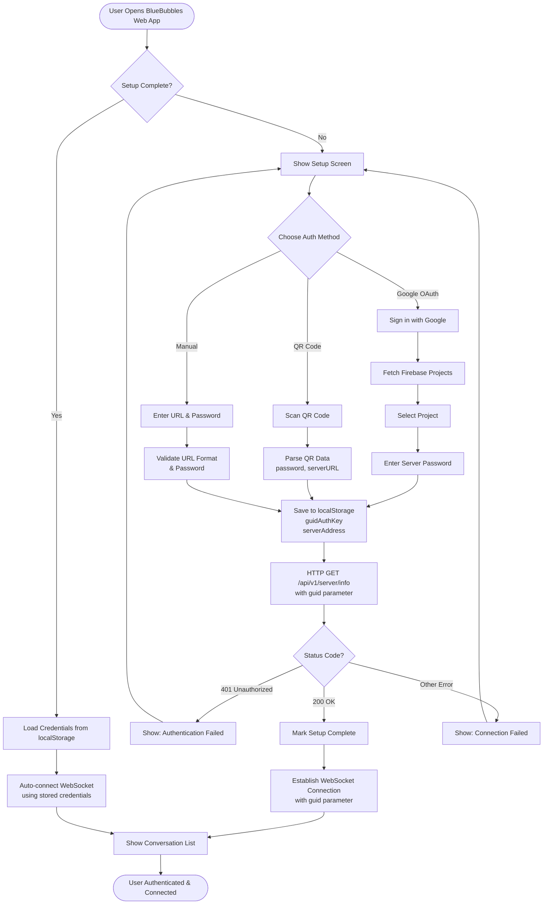
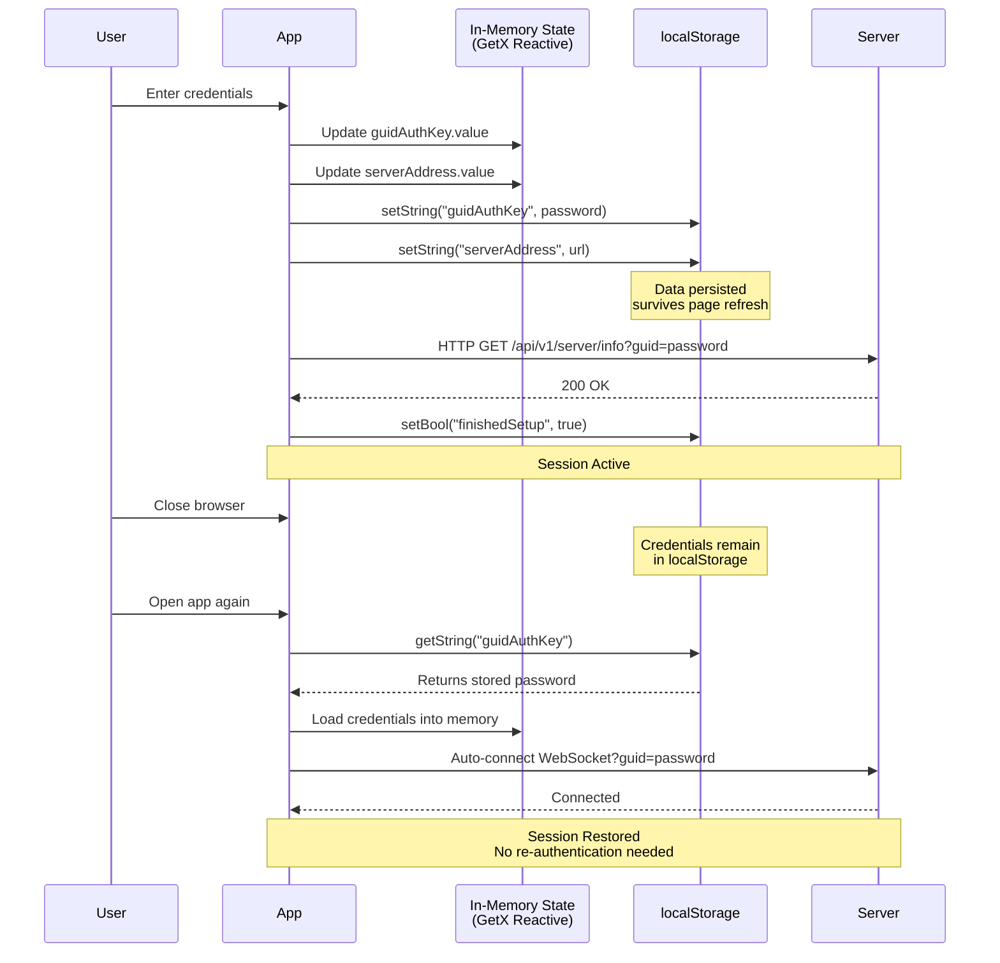
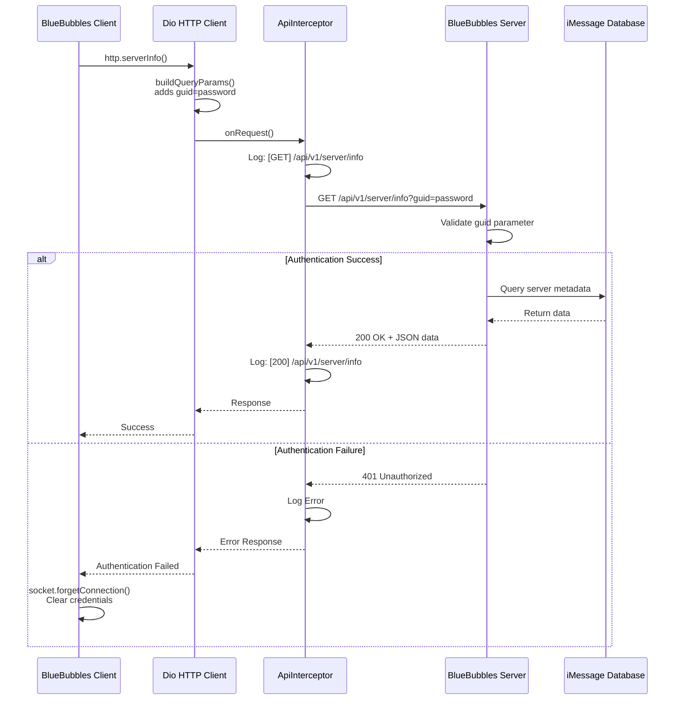
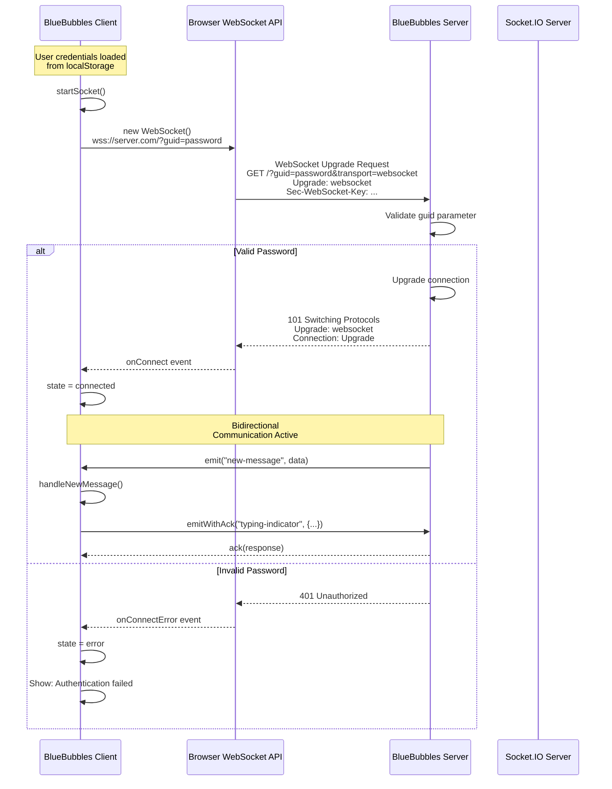
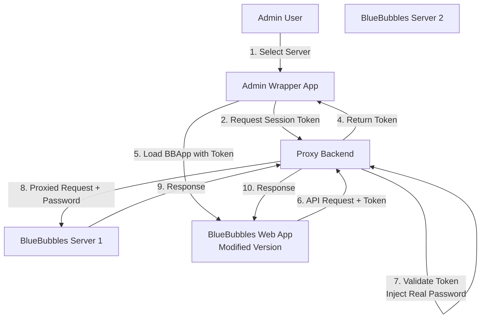

# BlueBubbles Web App Authentication Research

**Research Date:** 2025-11-11
**Application:** BlueBubbles Web App
**Platform:** Flutter Web (Dart compiled to JavaScript)
**Repository:** BlueBubbles App

---

## Executive Summary

This document provides a comprehensive technical analysis of the authentication system used by the BlueBubbles web application. The research was conducted to understand how users authenticate to BlueBubbles servers and how browser storage is utilized, with the goal of implementing an auto-login wrapper system that allows administrators to seamlessly access multiple BlueBubbles servers without manual authentication for each server.

### Key Findings

1. **Authentication Method**: Password-based authentication using a shared secret (not OAuth, JWT, or session tokens)
2. **Storage Mechanism**: Browser localStorage (via Flutter's SharedPreferences package)
3. **API Security**: Password sent as query parameter (`guid`) in all HTTP requests and WebSocket connections
4. **Session Persistence**: Automatic reconnection on app restart using stored credentials
5. **No Token Refresh**: Credentials persist indefinitely until manually cleared

---

## Table of Contents

1. [Application Architecture](#application-architecture)
2. [Authentication Flow](#authentication-flow)
3. [Technical Deep Dive](#technical-deep-dive)
4. [Browser Storage Analysis](#browser-storage-analysis)
5. [API Communication](#api-communication)
6. [WebSocket Authentication](#websocket-authentication)
7. [Security Considerations](#security-considerations)
8. [Auto-Login Wrapper Solutions](#auto-login-wrapper-solutions)
9. [Implementation Recommendations](#implementation-recommendations)
10. [Appendix: Code References](#appendix-code-references)

---

## Application Architecture

### Technology Stack

The BlueBubbles web application is **not** a traditional JavaScript web application. It is a **Flutter application** compiled to web using Dart-to-JavaScript compilation.

**Key Technologies:**
- **Framework**: Flutter Web (Dart)
- **State Management**: GetX (reactive state management)
- **HTTP Client**: Dio (Dart HTTP client)
- **WebSocket**: Socket.IO Client for Dart
- **Storage**: SharedPreferences (Flutter package that uses localStorage on web)
- **Authentication**: Custom password-based system

### Application Structure

```
/web/                   # Flutter web platform assets
  ├── index.html        # Entry point (minimal HTML bootstrap)
  ├── manifest.json     # PWA manifest
  └── splash/           # Splash screen assets

/lib/                   # Dart source code (MAIN APPLICATION CODE)
  ├── main.dart         # Application entry point
  ├── app/              # UI components
  │   └── layouts/
  │       └── setup/
  │           └── pages/sync/
  │               └── server_credentials.dart  # LOGIN UI
  ├── services/         # Backend services
  │   ├── network/
  │   │   ├── http_service.dart      # HTTP client & API calls
  │   │   └── socket_service.dart    # WebSocket connection
  │   └── backend/
  │       └── settings/
  │           └── settings_service.dart  # Settings persistence
  ├── database/         # Data models
  │   └── global/
  │       └── settings.dart  # Settings model (credentials storage)
  └── helpers/          # Utility functions
      └── backend/
          └── settings_helpers.dart  # Credential management helpers
```

---

## Authentication Flow

### Overview

BlueBubbles uses a **password-based authentication model** where the user provides:
1. **Server URL** (e.g., `https://your-server.com` or Firebase project URL)
2. **Server Password** (referred to internally as `guidAuthKey`)

There are **three authentication methods** available during initial setup:

1. **Google OAuth** (for Firebase-hosted servers)
2. **QR Code Scanning** (password and URL encoded in QR)
3. **Manual Entry** (direct URL and password input)

### High-Level Flow Diagram



### Detailed Authentication Steps

#### Step 1: Initial Setup Check

When the app launches, the `main.dart` entry point checks:

```
if (settings.finishedSetup.value == false)
    → Navigate to SetupView
else
    → Load credentials from localStorage
    → Auto-connect to server
    → Show ConversationList
```

**File Location**: `/lib/main.dart`

#### Step 2: Credential Capture

The user enters credentials via one of three methods:

**Method 1: Manual Entry**
- User enters `serverAddress` in URL field
- User enters `guidAuthKey` in password field
- URL is sanitized (schema validation, port handling, domain validation)
- Both values stored in reactive state via GetX

**Method 2: QR Code Scan**
- QR code contains JSON array: `[password, serverUrl]`
- App parses JSON and extracts credentials
- Same validation and storage as manual entry

**Method 3: Google OAuth**
- User authenticates with Google
- App fetches Firebase projects associated with account
- User selects project (which contains server URL in Firebase config)
- User enters server password
- Credentials stored

**File Locations**:
- `/lib/app/layouts/setup/pages/sync/server_credentials.dart` (UI)
- `/lib/helpers/ui/oauth_helpers.dart` (OAuth logic)

#### Step 3: Credential Storage

Credentials are stored in two locations:

**In-Memory Storage (Reactive State)**:
```dart
// GetX reactive variables in Settings class
RxString guidAuthKey = "your_password".obs;
RxString serverAddress = "https://your-server.com".obs;
RxMap<String, String> customHeaders = {}.obs;
```

**Persistent Storage (localStorage via SharedPreferences)**:
```dart
await ss.prefs.setString("guidAuthKey", password);
await ss.prefs.setString("serverAddress", url);
await ss.prefs.setString("customHeaders", jsonEncode(headers));
```

When stored to localStorage on web, these become:
```
localStorage.setItem("flutter.guidAuthKey", "your_password")
localStorage.setItem("flutter.serverAddress", "https://your-server.com")
localStorage.setItem("flutter.customHeaders", "{}")
```

**File Location**: `/lib/database/global/settings.dart`

#### Step 4: Connection Validation

After credentials are entered, the app validates them:

```dart
// 1. HTTP request to test authentication
Response serverResponse = await http.serverInfo();

// 2. Check response status
if (serverResponse.statusCode == 401) {
    // Authentication failed - clear credentials
    socket.forgetConnection();
    show error: "Authentication failed. Incorrect password!"
}

if (serverResponse.statusCode == 200) {
    // Success - establish WebSocket connection
    socket.restartSocket();
    goToNextPage();
}
```

**File Location**: `/lib/app/layouts/setup/pages/sync/server_credentials.dart:611-743` (connect function)

#### Step 5: WebSocket Establishment

Once HTTP authentication succeeds, a persistent WebSocket connection is established:

```dart
OptionBuilder options = OptionBuilder()
    .setQuery({"guid": password})  // ← Password included in query
    .setTransports(['websocket', 'polling'])
    .setExtraHeaders(http.headers)
    .disableAutoConnect()
    .enableReconnection();

socket = io(serverAddress, options.build());
socket.connect();
```

**File Location**: `/lib/services/network/socket_service.dart:57-100`

#### Step 6: Session Persistence

On subsequent app launches:

1. App checks `finishedSetup` flag in localStorage
2. If true, loads `guidAuthKey` and `serverAddress` from localStorage
3. Automatically establishes HTTP client with stored credentials
4. Automatically reconnects WebSocket with stored credentials
5. No re-authentication required

**File Location**: `/lib/helpers/backend/startup_tasks.dart`

---

## Technical Deep Dive

### Authentication Mechanism

#### What BlueBubbles Authentication Is NOT

❌ **Not OAuth 2.0**: No access tokens, refresh tokens, or authorization codes
❌ **Not JWT-based**: No JSON Web Tokens for stateless authentication
❌ **Not Session Cookie-based**: No server-side session management
❌ **Not API Key-based**: While it functions similarly, it's specifically called a "password"
❌ **Not Multi-Factor Authentication**: Single password is sufficient

#### What BlueBubbles Authentication IS

✅ **Shared Secret Authentication**: A single password acts as both:
   - **Authentication credential** (proves identity to server)
   - **Encryption key** (used to encrypt/decrypt certain message types)

✅ **Query Parameter Authentication**: The password is sent in every request:
```
GET /api/v1/server/info?guid=YOUR_PASSWORD_HERE
GET /api/v1/chat/query?guid=YOUR_PASSWORD_HERE
POST /api/v1/message/text?guid=YOUR_PASSWORD_HERE
```

✅ **Persistent Authentication**: Once authenticated:
   - No token expiration
   - No refresh mechanism needed
   - Credentials remain valid until server password is changed
   - Client must store password indefinitely

### Code Flow Analysis

#### Login Function (server_credentials.dart:611-743)

```dart
Future<void> connect(String url, String password) async {
    // 1. URL validation and sanitization
    url = sanitizeServerAddress(address: url);

    // 2. Store credentials in memory
    ss.settings.guidAuthKey.value = password;

    // 3. Persist credentials to localStorage
    await saveNewServerUrl(addr, saveAdditionalSettings: ["guidAuthKey"]);

    // 4. Show loading dialog
    showDialog(context, "Fetching server info...");

    // 5. Test authentication with HTTP request
    Response? serverResponse;
    await http.serverInfo().then((response) {
        serverResponse = response;
    }).catchError((err) {
        serverResponse = err;
    });

    // 6. Validate response
    if (serverResponse?.statusCode == 401) {
        // Clear credentials on auth failure
        socket.forgetConnection();
        return error("Authentication failed. Incorrect password!");
    }

    if (serverResponse?.statusCode == 200) {
        // 7. Establish WebSocket on success
        socket.restartSocket();

        // 8. Navigate to main app
        goToNextPage();
    }
}
```

**Key Observations**:
- Password is stored BEFORE validation (optimistic storage)
- If validation fails (401), credentials are cleared via `socket.forgetConnection()`
- Success (200) triggers immediate WebSocket connection
- No token exchange occurs - password IS the long-term credential

#### HTTP Request Building (http_service.dart:22-31)

Every API request includes the password via this helper function:

```dart
Map<String, dynamic> buildQueryParams([Map<String, dynamic> params = const {}]) {
    // Cannot add items to a const map
    if (params.isEmpty) {
        params = {};
    }

    // Add password to EVERY request
    params['guid'] = ss.settings.guidAuthKey.value;

    return params;
}
```

**Usage Example**:
```dart
// Ping endpoint
await dio.get(
    "$apiRoot/ping",
    queryParameters: buildQueryParams(),  // ← Adds guid=password
);

// Send message endpoint
await dio.post(
    "$apiRoot/message/text",
    queryParameters: buildQueryParams(),  // ← Adds guid=password
    data: messageData,
);
```

**Result**: All HTTP requests include `?guid=YOUR_PASSWORD` in the URL

#### WebSocket Authentication (socket_service.dart:57-100)

```dart
void startSocket() {
    // Get password from stored settings
    String password = ss.settings.guidAuthKey.value;

    // Create Socket.IO client with password in query
    OptionBuilder options = OptionBuilder()
        .setQuery({"guid": password})  // ← Password sent to server
        .setTransports(['websocket', 'polling'])
        .setExtraHeaders(http.headers)
        .disableAutoConnect()
        .enableReconnection();

    // Connect to server WebSocket endpoint
    socket = io(serverAddress, options.build());

    // Set up event listeners
    socket.onConnect((data) => handleConnect(data));
    socket.onDisconnect((data) => handleDisconnect(data));

    // Initiate connection
    socket.connect();
}
```

**WebSocket Connection URL**:
```
wss://your-server.com/?guid=YOUR_PASSWORD&transport=websocket
```

**Key Observations**:
- Password sent as query parameter (visible in WebSocket handshake)
- Automatic reconnection enabled (uses same stored password)
- No token refresh or re-authentication on reconnect

---

## Browser Storage Analysis

### Storage Technology: SharedPreferences → localStorage

Flutter's `SharedPreferences` package provides cross-platform persistent key-value storage. On web platforms, it uses the browser's **localStorage API** as the underlying storage mechanism.

### localStorage Structure

When you examine the browser's localStorage (via Developer Tools → Application → Local Storage), you'll see entries with the `flutter.` prefix:

```javascript
// Credential Storage
localStorage.getItem("flutter.guidAuthKey")
// Returns: "your_server_password_here"

localStorage.getItem("flutter.serverAddress")
// Returns: "https://your-server.com"

localStorage.getItem("flutter.customHeaders")
// Returns: "{}"  (JSON string of custom headers)

// Setup Status
localStorage.getItem("flutter.finishedSetup")
// Returns: "true" (boolean stored as string)
```

### Storage Lifecycle



### What Gets Stored

**Essential Credentials**:
| Key | Type | Purpose | Example Value |
|-----|------|---------|---------------|
| `flutter.guidAuthKey` | String | Server password / auth key | `"abc123xyz789"` |
| `flutter.serverAddress` | String | Server base URL | `"https://server.example.com"` |
| `flutter.customHeaders` | JSON String | Additional HTTP headers | `"{\"ngrok-skip-browser-warning\":\"true\"}"` |

**Setup State**:
| Key | Type | Purpose | Example Value |
|-----|------|---------|---------------|
| `flutter.finishedSetup` | Boolean | Has user completed setup? | `"true"` |
| `flutter.reachedConversationList` | Boolean | Has user reached main screen? | `"true"` |

**Additional Settings** (non-authentication):
- Theme preferences
- UI settings (avatar scale, bubble colors, etc.)
- Notification preferences
- Display settings

### Storage Security Characteristics

**✅ Advantages**:
- Persistent across browser sessions
- Survives page refreshes
- Automatic serialization/deserialization
- Cross-tab synchronization (same origin)

**⚠️ Security Considerations**:
- **No encryption**: localStorage stores data in **plaintext**
- **JavaScript accessible**: Any script on the same origin can read localStorage
- **XSS vulnerable**: Cross-site scripting attacks can steal credentials
- **No expiration**: Credentials persist indefinitely (no automatic logout)
- **Browser security**: Relies entirely on browser's origin isolation

### Data Persistence Behavior

**Persist Across**:
- ✅ Page refresh/reload
- ✅ Browser restart
- ✅ Multiple tabs (same origin)
- ✅ Private/Incognito mode (separate storage)

**Cleared By**:
- ❌ User manually clears browser data
- ❌ User uses "Clear Site Data" in developer tools
- ❌ User clicks "Forget Connection" in app (calls `socket.forgetConnection()`)
- ❌ Browser storage quota exceeded (rare)

---

## API Communication

### HTTP Client Architecture

BlueBubbles uses the **Dio** HTTP client library for all API requests. Dio is a powerful Dart HTTP client with support for interceptors, global configuration, and detailed error handling.

**File Location**: `/lib/services/network/http_service.dart`

### Base Configuration

```dart
class HttpService extends GetxService {
    late Dio dio;
    String? originOverride;

    // Construct API root URL from stored server address
    String get origin => Uri.parse(ss.settings.serverAddress.value).origin;
    String get apiRoot => "$origin/api/v1";

    @override
    void onInit() {
        dio = Dio(BaseOptions(
            connectTimeout: Duration(milliseconds: 15000),
            receiveTimeout: Duration(milliseconds: ss.settings.apiTimeout.value),
            sendTimeout: Duration(milliseconds: ss.settings.apiTimeout.value),
            headers: headers,  // Custom headers (ngrok, cloudflare, etc.)
        ));

        // Add logging interceptor
        dio.interceptors.add(ApiInterceptor());
    }
}
```

### Authentication in Every Request

**Core Pattern**: The `buildQueryParams()` helper function ensures EVERY API request includes the password:

```dart
Map<String, dynamic> buildQueryParams([Map<String, dynamic> params = const {}]) {
    if (params.isEmpty) {
        params = {};
    }
    // ↓ THIS IS THE KEY LINE - PASSWORD IN EVERY REQUEST
    params['guid'] = ss.settings.guidAuthKey.value;
    return params;
}
```

**Example API Calls**:

```dart
// 1. Server Info (used to validate auth during login)
Future<Response> serverInfo() async {
    final response = await dio.get(
        "$apiRoot/server/info",
        queryParameters: buildQueryParams(),  // Adds ?guid=password
    );
    return response;
}

// 2. Fetch Chats
Future<Response> chats() async {
    final response = await dio.post(
        "$apiRoot/chat/query",
        queryParameters: buildQueryParams(),  // Adds ?guid=password
        data: {"with": [], "offset": 0, "limit": 100},
    );
    return response;
}

// 3. Send Message
Future<Response> sendMessage(String chatGuid, String message) async {
    final response = await dio.post(
        "$apiRoot/message/text",
        queryParameters: buildQueryParams(),  // Adds ?guid=password
        data: {
            "chatGuid": chatGuid,
            "message": message,
        },
    );
    return response;
}
```

### Request/Response Flow



### API Endpoint Categories

**Server Management** (password required):
- `GET /api/v1/server/info` - Server metadata, version, capabilities
- `GET /api/v1/server/statistics/totals` - Message/chat counts
- `POST /api/v1/server/restart/soft` - Restart server services
- `GET /api/v1/server/logs` - Retrieve server logs

**Chat Operations** (password required):
- `POST /api/v1/chat/query` - List all chats
- `GET /api/v1/chat/:guid` - Get single chat details
- `GET /api/v1/chat/:guid/message` - Get messages for chat
- `POST /api/v1/chat/:guid/read` - Mark chat as read
- `DELETE /api/v1/chat/:guid` - Delete chat

**Message Operations** (password required):
- `POST /api/v1/message/text` - Send text message
- `POST /api/v1/message/attachment` - Send attachment
- `POST /api/v1/message/react` - Send tapback/reaction
- `POST /api/v1/message/:guid/edit` - Edit message (iOS 16+)
- `POST /api/v1/message/:guid/unsend` - Unsend message (iOS 16+)

**Attachment Operations** (password required):
- `GET /api/v1/attachment/:guid` - Get attachment metadata
- `GET /api/v1/attachment/:guid/download` - Download attachment file
- `GET /api/v1/attachment/:guid/blurhash` - Get blurhash preview

**Contact Operations** (password required):
- `GET /api/v1/contact` - Get all iCloud contacts
- `POST /api/v1/contact/query` - Query contacts by address
- `POST /api/v1/contact` - Create new contact

### Error Handling

**Status Code Meanings**:
| Code | Meaning | Client Action |
|------|---------|---------------|
| `200` | Success | Process response data |
| `401` | Unauthorized | Clear credentials, show login screen |
| `404` | Not Found | Resource doesn't exist (chat, message, etc.) |
| `500` | Server Error | Retry request, show error to user |
| `502` | Bad Gateway | Common with Cloudflare tunnels, auto-retry once |
| `timeout` | Request Timeout | Show "Failed to connect" error |

**ApiInterceptor Error Logging**:

```dart
@override
void onError(DioException err, ErrorInterceptorHandler handler) {
    // Remove sensitive data from logs
    final params = err.requestOptions.queryParameters;
    params.remove("guid");      // ← Remove password from logs
    params.remove("password");

    Logger.error("""Failed Request: [${err.requestOptions.method}] ${err.requestOptions.path}
  -> Error: ${err.error ?? 'No Error'}
  -> Request Params: ${params.toString()}
  -> Response Status: ${err.response?.statusCode ?? 'No Response'}
  -> Response Data: ${err.response?.data ?? 'No Data'}""");

    return super.onError(err, handler);
}
```

**Key Security Note**: The interceptor **removes the password from logs** to prevent credential leakage in console output.

---

## WebSocket Authentication

### Socket.IO Connection

BlueBubbles uses the **socket_io_client** Dart package for real-time bidirectional communication with the server. This enables instant message delivery, typing indicators, and read receipts.

**File Location**: `/lib/services/network/socket_service.dart`

### Connection Establishment

```dart
void startSocket() {
    // Build Socket.IO options
    OptionBuilder options = OptionBuilder()
        .setQuery({"guid": password})           // ← AUTH: Password in query
        .setTransports(['websocket', 'polling']) // Try WebSocket first, fallback to polling
        .setExtraHeaders(http.headers)          // Custom headers (ngrok, cloudflare)
        .disableAutoConnect()                    // Manual connection control
        .enableReconnection();                   // Auto-reconnect on disconnect

    // Create Socket.IO client instance
    socket = io(serverAddress, options.build());

    // Don't connect yet if no server address configured
    if (isNullOrEmpty(serverAddress)) return;

    // Set up connection event handlers
    socket.onConnect((data) => handleStatusUpdate(SocketState.connected, data));
    socket.onReconnect((data) => handleStatusUpdate(SocketState.connected, data));
    socket.onDisconnect((data) => handleStatusUpdate(SocketState.disconnected, data));
    socket.onConnectError((data) => handleStatusUpdate(SocketState.error, data));

    // Set up custom message event handlers
    socket.on("new-message", (data) => handleNewMessage(data));
    socket.on("updated-message", (data) => handleUpdatedMessage(data));
    socket.on("typing-indicator", (data) => handleTypingIndicator(data));
    socket.on("chat-read-status-changed", (data) => handleReadStatus(data));

    // Initiate connection
    socket.connect();
}
```

### WebSocket Handshake Flow



### Connection States

The WebSocket connection can be in one of four states:

```dart
enum SocketState {
    connected,      // Successfully connected, receiving/sending events
    disconnected,   // Not connected, no active connection
    error,          // Connection error occurred (auth failure, network issue)
    connecting,     // Attempting to connect or reconnect
}
```

**State Transitions**:
```
disconnected → connecting → connected
     ↑             ↓
     └────── error ←────────┘
```

### Automatic Reconnection

When the connection drops (network loss, server restart, etc.), the Socket.IO client automatically attempts to reconnect:

```dart
void handleStatusUpdate(SocketState status, dynamic data) {
    switch (status) {
        case SocketState.connected:
            state.value = SocketState.connected;
            NetworkTasks.onConnect();  // Sync data on reconnect
            notif.clearSocketError();   // Clear error notifications
            break;

        case SocketState.error:
            state.value = SocketState.error;

            // After 5 seconds, try to fetch new server URL (for dynamic servers)
            // and restart the socket connection
            _reconnectTimer = Timer(Duration(seconds: 5), () async {
                if (state.value == SocketState.connected) return;

                await fdb.fetchNewUrl();  // Check Firebase for new server URL
                restartSocket();          // Restart with new URL
            });
            break;
    }
}
```

**Key Points**:
- Reconnection uses **same stored password** (no re-authentication needed)
- For Firebase-hosted servers, client can fetch new server URL if IP changes
- Reconnection is automatic and transparent to the user
- No token refresh or credential renewal required

### Real-Time Events

**Incoming Events (Server → Client)**:

| Event Name | Payload | Purpose |
|------------|---------|---------|
| `new-message` | Message object | New message received in any chat |
| `updated-message` | Message object | Existing message edited/deleted |
| `typing-indicator` | `{chatGuid, display}` | Someone is typing in a chat |
| `chat-read-status-changed` | `{chatGuid, read}` | Chat marked read/unread |
| `group-name-change` | Chat object | Group chat renamed |
| `participant-added` | Handle object | User added to group chat |
| `participant-removed` | Handle object | User removed from group chat |
| `incoming-facetime` | Call object | FaceTime call incoming |
| `ft-call-status-changed` | Call object | FaceTime call status changed |

**Outgoing Events (Client → Server)**:

| Event Name | Payload | Purpose |
|------------|---------|---------|
| `typing-indicator` | `{chatGuid}` | Send typing status to other participants |
| `get-chat` | `{chatGuid}` | Request full chat data |
| `get-messages` | `{chatGuid, limit}` | Request messages for chat |

### Encrypted WebSocket Messages

Some sensitive data sent over WebSocket is encrypted using AES-CryptoJS:

```dart
Future<Map<String, dynamic>> sendMessage(String event, Map<String, dynamic> message) {
    socket.emitWithAck(event, message, ack: (response) {
        // Check if response is encrypted
        if (response['encrypted'] == true) {
            // Decrypt using the server password as the key
            response['data'] = jsonDecode(
                decryptAESCryptoJS(response['data'], password)
            );
        }

        completer.complete(response);
    });

    return completer.future;
}
```

**Encryption Characteristics**:
- **Encryption Key**: The server password (`guidAuthKey`) doubles as the AES encryption key
- **Algorithm**: AES-CryptoJS (compatible with JavaScript's crypto-js library)
- **Use Cases**: Sensitive data in WebSocket responses (not all messages are encrypted)
- **Security Implication**: If the password is compromised, both authentication and encryption are broken

---

## Security Considerations

### Vulnerability Analysis

#### 1. **Password in URL Query Parameters**

**Issue**: The server password is sent as a query parameter in EVERY HTTP request:
```
GET /api/v1/server/info?guid=YOUR_PASSWORD_HERE
```

**Risks**:
- ⚠️ URLs are logged by web servers, proxies, and browser history
- ⚠️ Query parameters visible in browser developer tools (Network tab)
- ⚠️ Credentials logged in server access logs (Apache, nginx, etc.)
- ⚠️ URLs may be leaked via Referer header when navigating to external sites
- ⚠️ Browser extensions can access full URL with credentials

**Mitigation** (current):
- ❌ None - this is the current authentication design
- ⚠️ ApiInterceptor removes password from **console logs** only (doesn't prevent other leakage)

**Industry Best Practice**:
- ✅ Use HTTP headers (`Authorization: Bearer <token>`) instead of query params
- ✅ Use POST body for sensitive data
- ✅ Never log sensitive credentials

#### 2. **localStorage Storage (Plaintext)**

**Issue**: Credentials stored in browser localStorage without encryption:
```javascript
localStorage.getItem("flutter.guidAuthKey")
// Returns: "your_password_in_plain_text"
```

**Risks**:
- ⚠️ XSS (Cross-Site Scripting) attacks can steal credentials via JavaScript injection
- ⚠️ Browser extensions with storage permissions can read all localStorage
- ⚠️ Physical access to computer allows credential extraction (browser developer tools)
- ⚠️ No encryption at rest

**Mitigation** (current):
- ⚠️ Relies on browser's same-origin policy
- ⚠️ Flutter's JavaScript isolation provides some protection
- ❌ No encryption or obfuscation applied

**Industry Best Practice**:
- ✅ Use httpOnly cookies (not accessible via JavaScript)
- ✅ Use sessionStorage instead of localStorage (cleared on tab close)
- ✅ Encrypt sensitive data before storing
- ✅ Use short-lived tokens instead of persistent passwords

#### 3. **Single Password for Both Auth and Encryption**

**Issue**: The `guidAuthKey` serves dual purposes:
- Authentication credential (proves identity)
- Encryption key (encrypts sensitive WebSocket messages)

**Risks**:
- ⚠️ Single point of failure: compromise password → lose both auth and encryption
- ⚠️ Cannot rotate encryption keys without changing authentication
- ⚠️ No key separation or defense in depth

**Industry Best Practice**:
- ✅ Separate authentication credentials from encryption keys
- ✅ Use public/private key pairs for encryption
- ✅ Rotate keys regularly

#### 4. **No Token Expiration or Refresh**

**Issue**: Once authenticated, credentials remain valid indefinitely with no expiration:
- ✅ No session timeout
- ✅ No automatic logout
- ✅ No token refresh mechanism

**Risks**:
- ⚠️ Stolen credentials remain valid forever
- ⚠️ No way to force re-authentication
- ⚠️ Shared computers: credentials persist across users

**Industry Best Practice**:
- ✅ Use short-lived access tokens (15 min to 1 hour)
- ✅ Use long-lived refresh tokens (30 days)
- ✅ Implement automatic token refresh
- ✅ Force re-authentication after period of inactivity

#### 5. **No Multi-Factor Authentication (MFA)**

**Issue**: Single password is sufficient for authentication.

**Risks**:
- ⚠️ Password compromise = full account access
- ⚠️ No second factor protection

**Industry Best Practice**:
- ✅ Support TOTP (Time-based One-Time Password) via Google Authenticator
- ✅ Support SMS or email-based 2FA
- ✅ Support hardware security keys (FIDO2/WebAuthn)

### Security Strengths

Despite the concerns above, BlueBubbles does have some security measures:

#### ✅ 1. HTTPS Enforcement
- Web version requires HTTPS (HTTP URLs rejected during setup)
- TLS encryption protects credentials in transit
- Prevents man-in-the-middle attacks

#### ✅ 2. Browser Same-Origin Policy
- localStorage accessible only from the same origin
- Cross-origin scripts cannot access credentials
- Each server instance has isolated storage

#### ✅ 3. Validation and Sanitization
- Server URL validated before connection attempt
- Malformed URLs rejected during setup
- Protection against injection attacks in URL field

#### ✅ 4. Credential Clearing on Auth Failure
```dart
if (serverResponse?.statusCode == 401) {
    socket.forgetConnection();  // Clears guidAuthKey and serverAddress
    return controller.updateConnectError("Authentication failed. Incorrect password!");
}
```
- Invalid credentials not persisted
- Prevents accidental storage of wrong passwords

#### ✅ 5. Custom Headers for Proxy Services
- Support for ngrok and Cloudflare tunnels
- Automatic header injection (`ngrok-skip-browser-warning`, `skip_zrok_interstitial`)
- Prevents interstitial pages from breaking auth flow

### Security Recommendations for Production

If deploying BlueBubbles in an enterprise or security-conscious environment:

#### High Priority

1. **Implement Token-Based Authentication**
   - Replace persistent password with short-lived JWT access tokens
   - Add refresh token mechanism
   - Move password from query params to Authorization header

2. **Encrypt localStorage Data**
   - Use Web Crypto API to encrypt credentials before storing
   - Derive encryption key from user PIN or device fingerprint
   - Clear encryption key on logout

3. **Add Session Timeout**
   - Implement automatic logout after 30 minutes of inactivity
   - Clear credentials from memory when session expires
   - Force re-authentication on timeout

#### Medium Priority

4. **Implement MFA Support**
   - Add optional TOTP support for high-security deployments
   - Require 2FA for admin accounts
   - Support backup codes

5. **Add Audit Logging**
   - Log all authentication attempts (success and failure)
   - Log credential changes
   - Alert on suspicious activity

6. **Rate Limiting**
   - Implement login rate limiting
   - Block brute-force attempts
   - Add CAPTCHA after failed login attempts

#### Low Priority

7. **Certificate Pinning**
   - Pin server TLS certificates
   - Prevent man-in-the-middle attacks
   - Alert on certificate changes

8. **Security Headers**
   - Implement CSP (Content Security Policy)
   - Add X-Frame-Options to prevent clickjacking
   - Enable HSTS (HTTP Strict Transport Security)

---

## Auto-Login Wrapper Solutions

### Problem Statement

**Goal**: Enable administrators to manage multiple BlueBubbles servers from a single web application, with seamless auto-login to each server without manually entering credentials each time.

**Current Challenge**: The BlueBubbles web app requires users to manually enter server URL and password during setup. There is no built-in mechanism for external applications to programmatically authenticate users.

**Requirements**:
1. Admin sees list of BlueBubbles servers in wrapper application
2. Admin clicks on a server
3. BlueBubbles web app loads **already authenticated** to that server
4. Process must work for multiple servers (switching between servers)
5. Process must be secure (credentials not exposed to unauthorized parties)

---

### Solution Option 1: URL Parameter Auto-Fill (Simple)

**Concept**: Modify the BlueBubbles web app to accept server URL and password as URL parameters, automatically fill the login form, and initiate connection.

**Implementation**:

```dart
// In server_credentials.dart, add URL parameter detection:
@override
void initState() {
    super.initState();

    // Check for URL parameters
    final uri = Uri.parse(window.location.href);
    final serverUrl = uri.queryParameters['serverUrl'];
    final password = uri.queryParameters['password'];

    if (serverUrl != null && password != null) {
        // Auto-fill and connect
        urlController.text = serverUrl;
        passwordController.text = password;

        // Wait for build to complete, then trigger connection
        WidgetsBinding.instance.addPostFrameCallback((_) {
            connect(serverUrl, password);
        });
    }
}
```

**Wrapper Application Usage**:
```javascript
// Admin clicks server from list
function openBlueBubblesServer(server) {
    const url = `https://bluebubbles.yourdomain.com/web/?serverUrl=${encodeURIComponent(server.url)}&password=${encodeURIComponent(server.password)}`;
    window.open(url, '_blank');
}
```

**Advantages**:
- ✅ Simple to implement
- ✅ No iframe complexity
- ✅ Works across domains
- ✅ User can bookmark authenticated URLs (if desired)

**Disadvantages**:
- ⚠️ **CRITICAL**: Credentials visible in URL
- ⚠️ Credentials logged in browser history
- ⚠️ Credentials logged in server access logs
- ⚠️ Credentials visible in network traffic (even with HTTPS, URL is visible in metadata)
- ⚠️ Credentials may leak via Referer header

**Security Mitigation**:
- Use one-time-use tokens instead of actual passwords
- Clear URL parameters immediately after use (via history.replaceState)
- Add URL parameter expiration timestamp

**Recommended Use Case**:
- ❌ **NOT RECOMMENDED for production** due to credential exposure
- ✅ Acceptable for internal development/testing only

**Code Modification Required**: ⭐ LOW (single file change)

---

### Solution Option 2: localStorage Injection via Iframe (Intermediate)

**Concept**: Load BlueBubbles web app in an iframe, inject credentials into the iframe's localStorage before the app initializes, then navigate the iframe to the app.

**Implementation**:

**Step 1**: Create a credential injection landing page within the BlueBubbles domain:

```html
<!-- /web/auth-injection.html -->
<!DOCTYPE html>
<html>
<head>
    <title>Authentication Setup</title>
</head>
<body>
    <script>
        // Listen for credentials from parent window
        window.addEventListener('message', (event) => {
            // Validate origin (IMPORTANT)
            if (event.origin !== 'https://your-admin-wrapper.com') {
                console.error('Unauthorized origin:', event.origin);
                return;
            }

            // Extract credentials from message
            const { serverUrl, password } = event.data;

            if (serverUrl && password) {
                // Inject into localStorage with Flutter prefix
                localStorage.setItem('flutter.serverAddress', serverUrl);
                localStorage.setItem('flutter.guidAuthKey', password);
                localStorage.setItem('flutter.finishedSetup', 'true');

                // Notify parent that injection is complete
                event.source.postMessage({ status: 'ready' }, event.origin);

                // Redirect to main app
                window.location.href = '/web/';
            }
        });

        // Notify parent that page is ready to receive credentials
        if (window.parent !== window) {
            window.parent.postMessage({ status: 'loaded' }, '*');
        }
    </script>
    <p>Authenticating...</p>
</body>
</html>
```

**Step 2**: Wrapper application iframe management:

```javascript
// Admin wrapper application
class BlueBubblesIframeManager {
    constructor(containerId) {
        this.container = document.getElementById(containerId);
        this.iframe = null;
    }

    loadServer(serverUrl, password) {
        // Create iframe pointing to injection page
        this.iframe = document.createElement('iframe');
        this.iframe.src = 'https://bluebubbles.yourdomain.com/web/auth-injection.html';
        this.iframe.style.width = '100%';
        this.iframe.style.height = '100vh';
        this.iframe.style.border = 'none';

        // Listen for ready signal from iframe
        window.addEventListener('message', (event) => {
            if (event.origin !== 'https://bluebubbles.yourdomain.com') return;

            if (event.data.status === 'loaded') {
                // Iframe loaded, send credentials
                this.iframe.contentWindow.postMessage({
                    serverUrl: serverUrl,
                    password: password
                }, 'https://bluebubbles.yourdomain.com');
            }

            if (event.data.status === 'ready') {
                // localStorage injection complete, iframe will redirect to main app
                console.log('BlueBubbles authenticated and loading...');
            }
        });

        // Add iframe to page
        this.container.innerHTML = '';
        this.container.appendChild(this.iframe);
    }
}

// Usage
const bbManager = new BlueBubblesIframeManager('bluebubbles-container');
bbManager.loadServer('https://your-server.com', 'your_password');
```

**Advantages**:
- ✅ Credentials not visible in URL
- ✅ Credentials not logged in browser history
- ✅ Embedded experience (no popup windows)
- ✅ Can switch servers by destroying and recreating iframe

**Disadvantages**:
- ⚠️ **CRITICAL**: Only works if admin wrapper and BlueBubbles web app are on the **same domain** (same-origin policy)
- ⚠️ postMessage security relies on strict origin checking
- ⚠️ Iframe can be slow to load
- ⚠️ Some features may not work in iframe (fullscreen, popups, etc.)
- ⚠️ Requires adding injection landing page to BlueBubbles repo

**Security Considerations**:
- ✅ **Must validate message origin** on both sides (wrapper → iframe, iframe → wrapper)
- ✅ Use allowlist of trusted origins
- ⚠️ Vulnerable to XSS in either wrapper or BlueBubbles app

**Recommended Use Case**:
- ✅ Good for **same-domain deployments** (e.g., wrapper at admin.example.com, BlueBubbles at bluebubbles.example.com)
- ⚠️ **NOT suitable for cross-domain** scenarios without CORS and additional security

**Code Modification Required**: ⭐⭐ MEDIUM (add injection page, postMessage handling)

---

### Solution Option 3: Backend Proxy with Session Tokens (Advanced)

**Concept**: Create a backend proxy server that:
1. Stores BlueBubbles server credentials securely
2. Generates short-lived session tokens for authenticated admins
3. Proxies all BlueBubbles API requests, injecting the real password
4. Serves modified BlueBubbles web app that uses session tokens instead of passwords

**Architecture**:



**Implementation**:

**Step 1**: Proxy backend (Node.js example):

```javascript
const express = require('express');
const axios = require('axios');
const crypto = require('crypto');

const app = express();
app.use(express.json());

// In-memory storage (use Redis/database in production)
const sessions = new Map(); // sessionToken → { serverUrl, password, expiry }
const servers = [
    { id: 1, name: 'Server 1', url: 'https://server1.com', password: 'pass123' },
    { id: 2, name: 'Server 2', url: 'https://server2.com', password: 'pass456' },
];

// Endpoint: Get available servers (admin authenticated via separate auth)
app.get('/api/servers', requireAdminAuth, (req, res) => {
    res.json(servers.map(s => ({ id: s.id, name: s.name, url: s.url })));
});

// Endpoint: Generate session token for a server
app.post('/api/sessions', requireAdminAuth, (req, res) => {
    const { serverId } = req.body;
    const server = servers.find(s => s.id === serverId);

    if (!server) {
        return res.status(404).json({ error: 'Server not found' });
    }

    // Generate cryptographically secure token
    const token = crypto.randomBytes(32).toString('hex');

    // Store session (expires in 1 hour)
    sessions.set(token, {
        serverUrl: server.url,
        password: server.password,
        expiry: Date.now() + 3600000 // 1 hour
    });

    res.json({ token, expiresIn: 3600 });
});

// Endpoint: Proxy all BlueBubbles API requests
app.all('/api/proxy/*', async (req, res) => {
    // Extract session token from Authorization header
    const authHeader = req.headers.authorization;
    if (!authHeader || !authHeader.startsWith('Bearer ')) {
        return res.status(401).json({ error: 'Missing session token' });
    }

    const token = authHeader.split(' ')[1];
    const session = sessions.get(token);

    // Validate session
    if (!session) {
        return res.status(401).json({ error: 'Invalid session token' });
    }

    if (session.expiry < Date.now()) {
        sessions.delete(token);
        return res.status(401).json({ error: 'Session expired' });
    }

    // Extract the actual BlueBubbles API path
    const bbPath = req.path.replace('/api/proxy', '');

    // Build target URL with real password
    const targetUrl = `${session.serverUrl}${bbPath}`;
    const params = { ...req.query, guid: session.password };

    try {
        // Proxy the request to the real BlueBubbles server
        const response = await axios({
            method: req.method,
            url: targetUrl,
            params: params,
            data: req.body,
            headers: {
                'Content-Type': req.headers['content-type']
            }
        });

        res.status(response.status).json(response.data);
    } catch (error) {
        res.status(error.response?.status || 500).json({
            error: error.message,
            data: error.response?.data
        });
    }
});

app.listen(3000, () => console.log('Proxy running on port 3000'));
```

**Step 2**: Modify BlueBubbles web app to use proxy:

```dart
// In http_service.dart, modify buildQueryParams to use token instead:

Map<String, dynamic> buildQueryParams([Map<String, dynamic> params = const {}]) {
    if (params.isEmpty) {
        params = {};
    }

    // Check if using proxy mode (session token in settings)
    if (ss.settings.sessionToken.isNotEmpty) {
        // DO NOT add guid parameter - proxy will handle it
        return params;
    }

    // Original behavior for direct connection
    params['guid'] = ss.settings.guidAuthKey.value;
    return params;
}

// Modify API root to use proxy if session token exists
String get apiRoot {
    if (ss.settings.sessionToken.isNotEmpty) {
        return "https://your-proxy.com/api/proxy/api/v1";
    }
    return "$origin/api/v1";
}

// Add Authorization header with session token
Map<String, String> get headers {
    final baseHeaders = ss.settings.customHeaders;

    if (ss.settings.sessionToken.isNotEmpty) {
        baseHeaders['Authorization'] = 'Bearer ${ss.settings.sessionToken.value}';
    }

    return baseHeaders;
}
```

**Step 3**: Wrapper application flow:

```javascript
// Admin selects server from list
async function selectServer(serverId) {
    // Request session token from proxy
    const response = await fetch('https://your-proxy.com/api/sessions', {
        method: 'POST',
        headers: {
            'Authorization': `Bearer ${adminToken}`,
            'Content-Type': 'application/json'
        },
        body: JSON.stringify({ serverId })
    });

    const { token } = await response.json();

    // Load BlueBubbles web app with session token as URL parameter
    const bbUrl = `https://bluebubbles-modified.yourdomain.com/web/?sessionToken=${token}`;
    window.open(bbUrl, '_blank');
}
```

**Advantages**:
- ✅ **Maximum security**: Real passwords never leave the proxy backend
- ✅ Short-lived tokens (expire after 1 hour)
- ✅ Centralized credential management
- ✅ Audit logging possible (track which admin accessed which server)
- ✅ Can revoke access instantly (delete session token)
- ✅ Works across domains
- ✅ Can implement additional security (rate limiting, IP allowlisting, etc.)

**Disadvantages**:
- ⚠️ Most complex solution
- ⚠️ Requires backend infrastructure (proxy server, database, etc.)
- ⚠️ Adds latency (extra hop for every request)
- ⚠️ Single point of failure (proxy must be highly available)
- ⚠️ Requires maintaining modified version of BlueBubbles web app
- ⚠️ Proxy becomes a security-critical component

**Recommended Use Case**:
- ✅ **BEST for enterprise/production deployments**
- ✅ When managing many servers (10+)
- ✅ When security is paramount
- ✅ When you need audit logging and access control

**Code Modification Required**: ⭐⭐⭐⭐ VERY HIGH (backend proxy, modified BlueBubbles app, session management)

---

### Solution Option 4: Browser Extension / Bookmarklet (Minimal Code Changes)

**Concept**: Create a browser extension or bookmarklet that injects credentials into localStorage before the BlueBubbles web app initializes.

**Implementation (Browser Extension)**:

**Step 1**: Extension manifest:

```json
{
    "manifest_version": 3,
    "name": "BlueBubbles Auto-Login",
    "version": "1.0",
    "permissions": ["storage", "tabs"],
    "host_permissions": ["https://bluebubbles.yourdomain.com/*"],
    "background": {
        "service_worker": "background.js"
    },
    "content_scripts": [{
        "matches": ["https://bluebubbles.yourdomain.com/*"],
        "js": ["content.js"],
        "run_at": "document_start"
    }]
}
```

**Step 2**: Content script (runs on BlueBubbles page):

```javascript
// content.js - Runs on BlueBubbles web app pages

// Check if URL contains special parameter indicating auto-login
const url = new URL(window.location.href);
const serverId = url.searchParams.get('autoLoginServer');

if (serverId) {
    // Request credentials from extension background script
    chrome.runtime.sendMessage(
        { action: 'getServerCredentials', serverId },
        (response) => {
            if (response && response.serverUrl && response.password) {
                // Inject credentials into localStorage
                localStorage.setItem('flutter.serverAddress', response.serverUrl);
                localStorage.setItem('flutter.guidAuthKey', response.password);
                localStorage.setItem('flutter.finishedSetup', 'true');

                // Remove URL parameter to avoid exposing server ID
                url.searchParams.delete('autoLoginServer');
                window.history.replaceState({}, '', url.toString());

                // Reload page so Flutter app picks up credentials
                window.location.reload();
            }
        }
    );
}
```

**Step 3**: Background script (manages credentials):

```javascript
// background.js - Extension background service worker

// Store server credentials (in real extension, use encrypted storage)
const servers = {
    'server1': {
        serverUrl: 'https://server1.com',
        password: 'pass123'
    },
    'server2': {
        serverUrl: 'https://server2.com',
        password: 'pass456'
    }
};

// Listen for messages from content script
chrome.runtime.onMessage.addListener((request, sender, sendResponse) => {
    if (request.action === 'getServerCredentials') {
        const serverId = request.serverId;
        const server = servers[serverId];

        if (server) {
            sendResponse(server);
        } else {
            sendResponse(null);
        }
    }
    return true; // Keep message channel open for async response
});
```

**Step 4**: Wrapper application integration:

```javascript
// Admin wrapper application
function openBlueBubblesServer(serverId) {
    // Open BlueBubbles with special URL parameter
    // Extension will detect this and inject credentials
    const url = `https://bluebubbles.yourdomain.com/web/?autoLoginServer=${serverId}`;
    window.open(url, '_blank');
}
```

**Implementation (Bookmarklet - Simpler)**:

```javascript
javascript:(function(){
    const servers = {
        'server1': { url: 'https://server1.com', pass: 'pass123' },
        'server2': { url: 'https://server2.com', pass: 'pass456' }
    };
    const id = prompt('Enter server ID (server1, server2):');
    const s = servers[id];
    if(s) {
        localStorage.setItem('flutter.serverAddress', s.url);
        localStorage.setItem('flutter.guidAuthKey', s.pass);
        localStorage.setItem('flutter.finishedSetup', 'true');
        location.reload();
    } else {
        alert('Invalid server ID');
    }
})();
```

**Advantages**:
- ✅ **No modification to BlueBubbles web app required**
- ✅ Credentials not exposed in URL or network traffic
- ✅ Easy to deploy (install extension once)
- ✅ Works across tabs
- ✅ Can be updated without redeploying BlueBubbles app

**Disadvantages**:
- ⚠️ Requires users to install browser extension
- ⚠️ Extension has access to all localStorage data (security risk if extension compromised)
- ⚠️ Extension store approval process (Chrome Web Store, Firefox Add-ons)
- ⚠️ Not suitable for non-technical users
- ⚠️ Bookmarklet version requires hardcoding credentials (very insecure)

**Recommended Use Case**:
- ✅ Good for **internal IT teams**
- ✅ When you cannot modify BlueBubbles app
- ✅ Small number of admins (easier to distribute extension)
- ⚠️ **NOT recommended for end users**

**Code Modification Required**: ⭐ NONE (BlueBubbles app unchanged), but requires extension development

---

### Solution Option 5: Fork & Modify BlueBubbles App with postMessage API (Recommended)

**Concept**: Fork the BlueBubbles repository and add an official authentication API that supports secure credential injection via postMessage (for iframe embedding) or direct function calls (for same-page integration).

**Implementation**:

**Step 1**: Add authentication API to BlueBubbles web app:

```dart
// Create new file: /lib/helpers/auth/auth_api.dart

import 'dart:html' as html;
import 'dart:convert';
import 'package:bluebubbles/services/services.dart';
import 'package:bluebubbles/helpers/helpers.dart';

class AuthAPI {
    static bool _initialized = false;
    static String? _trustedOrigin;

    /// Initialize the authentication API for iframe embedding
    /// [trustedOrigin] - Only accept credentials from this origin (e.g., 'https://admin.example.com')
    static void initialize({String? trustedOrigin}) {
        if (_initialized) return;

        _trustedOrigin = trustedOrigin;

        // Listen for postMessage events from parent window
        html.window.onMessage.listen((event) {
            _handleMessage(event);
        });

        _initialized = true;

        // Notify parent window that we're ready to receive auth messages
        _postMessageToParent({'type': 'bb:ready'});
    }

    static void _handleMessage(html.MessageEvent event) {
        // Validate origin if trusted origin is set
        if (_trustedOrigin != null && event.origin != _trustedOrigin) {
            print('AuthAPI: Rejected message from untrusted origin: ${event.origin}');
            return;
        }

        // Parse message data
        final data = event.data;
        if (data is! Map) return;

        final type = data['type'] as String?;
        if (type == null) return;

        switch (type) {
            case 'bb:authenticate':
                _handleAuthenticate(data, event.source, event.origin);
                break;
            case 'bb:logout':
                _handleLogout(event.source, event.origin);
                break;
            case 'bb:getStatus':
                _handleGetStatus(event.source, event.origin);
                break;
        }
    }

    static Future<void> _handleAuthenticate(
        Map data,
        html.WindowBase? source,
        String origin
    ) async {
        final serverUrl = data['serverUrl'] as String?;
        final password = data['password'] as String?;

        if (serverUrl == null || password == null) {
            _postMessageToSource(source, origin, {
                'type': 'bb:authenticate:error',
                'error': 'Missing serverUrl or password'
            });
            return;
        }

        // Sanitize server URL
        String? sanitizedUrl = sanitizeServerAddress(address: serverUrl);
        if (sanitizedUrl == null) {
            _postMessageToSource(source, origin, {
                'type': 'bb:authenticate:error',
                'error': 'Invalid server URL'
            });
            return;
        }

        // Store credentials
        ss.settings.guidAuthKey.value = password;
        await saveNewServerUrl(sanitizedUrl, saveAdditionalSettings: ["guidAuthKey"]);

        // Test connection
        try {
            final response = await http.serverInfo();

            if (response.statusCode == 401) {
                // Auth failed - clear credentials
                socket.forgetConnection();
                _postMessageToSource(source, origin, {
                    'type': 'bb:authenticate:error',
                    'error': 'Authentication failed. Incorrect password.'
                });
                return;
            }

            if (response.statusCode == 200) {
                // Success - establish WebSocket
                socket.restartSocket();
                ss.settings.finishedSetup.value = true;
                await ss.saveSettings();

                _postMessageToSource(source, origin, {
                    'type': 'bb:authenticate:success',
                    'serverUrl': sanitizedUrl
                });
                return;
            }

            // Other error
            _postMessageToSource(source, origin, {
                'type': 'bb:authenticate:error',
                'error': 'Connection failed'
            });
        } catch (e) {
            _postMessageToSource(source, origin, {
                'type': 'bb:authenticate:error',
                'error': e.toString()
            });
        }
    }

    static void _handleLogout(html.WindowBase? source, String origin) {
        socket.forgetConnection();
        ss.settings.finishedSetup.value = false;
        ss.saveSettings();

        _postMessageToSource(source, origin, {
            'type': 'bb:logout:success'
        });
    }

    static void _handleGetStatus(html.WindowBase? source, String origin) {
        _postMessageToSource(source, origin, {
            'type': 'bb:status',
            'authenticated': ss.settings.finishedSetup.value,
            'serverUrl': ss.settings.serverAddress.value,
            'connected': socket.state.value == SocketState.connected,
        });
    }

    static void _postMessageToParent(Map data) {
        if (html.window.parent != html.window) {
            html.window.parent!.postMessage(data, '*');
        }
    }

    static void _postMessageToSource(
        html.WindowBase? source,
        String origin,
        Map data
    ) {
        source?.postMessage(data, origin);
    }
}
```

**Step 2**: Initialize API in main.dart:

```dart
// In main.dart, add initialization:

void main() async {
    WidgetsFlutterBinding.ensureInitialized();

    // ... existing initialization code ...

    // Initialize authentication API for iframe embedding
    if (kIsWeb) {
        AuthAPI.initialize(
            // Set trusted origin (or null to accept from any origin - less secure)
            trustedOrigin: 'https://admin.example.com'
        );
    }

    runApp(MyApp());
}
```

**Step 3**: Wrapper application iframe management (JavaScript):

```javascript
class BlueBubblesAuthenticator {
    constructor(iframeElement) {
        this.iframe = iframeElement;
        this.ready = false;
        this.messageHandlers = new Map();

        // Listen for messages from iframe
        window.addEventListener('message', (event) => {
            this.handleMessage(event);
        });
    }

    handleMessage(event) {
        // Validate origin
        if (event.origin !== 'https://bluebubbles.yourdomain.com') {
            console.error('Message from untrusted origin:', event.origin);
            return;
        }

        const data = event.data;
        if (!data || !data.type) return;

        switch (data.type) {
            case 'bb:ready':
                this.ready = true;
                console.log('BlueBubbles iframe ready');
                this.onReady?.();
                break;

            case 'bb:authenticate:success':
                console.log('Authentication successful:', data.serverUrl);
                this.onAuthSuccess?.();
                break;

            case 'bb:authenticate:error':
                console.error('Authentication failed:', data.error);
                this.onAuthError?.(data.error);
                break;

            case 'bb:status':
                console.log('Status:', data);
                this.onStatus?.(data);
                break;
        }
    }

    async authenticate(serverUrl, password) {
        if (!this.ready) {
            throw new Error('BlueBubbles iframe not ready yet');
        }

        return new Promise((resolve, reject) => {
            // Set up one-time listeners for response
            this.onAuthSuccess = () => {
                this.onAuthSuccess = null;
                this.onAuthError = null;
                resolve();
            };

            this.onAuthError = (error) => {
                this.onAuthSuccess = null;
                this.onAuthError = null;
                reject(new Error(error));
            };

            // Send authentication request
            this.iframe.contentWindow.postMessage({
                type: 'bb:authenticate',
                serverUrl: serverUrl,
                password: password
            }, 'https://bluebubbles.yourdomain.com');

            // Timeout after 30 seconds
            setTimeout(() => {
                if (this.onAuthSuccess || this.onAuthError) {
                    this.onAuthSuccess = null;
                    this.onAuthError = null;
                    reject(new Error('Authentication timeout'));
                }
            }, 30000);
        });
    }

    logout() {
        this.iframe.contentWindow.postMessage({
            type: 'bb:logout'
        }, 'https://bluebubbles.yourdomain.com');
    }

    getStatus() {
        this.iframe.contentWindow.postMessage({
            type: 'bb:getStatus'
        }, 'https://bluebubbles.yourdomain.com');
    }
}

// Usage in wrapper application:
async function loadBlueBubblesServer(serverId) {
    // Create iframe
    const iframe = document.createElement('iframe');
    iframe.src = 'https://bluebubbles.yourdomain.com/web/';
    iframe.style.width = '100%';
    iframe.style.height = '100vh';
    iframe.style.border = 'none';
    document.getElementById('bb-container').appendChild(iframe);

    // Create authenticator
    const auth = new BlueBubblesAuthenticator(iframe);

    // Wait for iframe to be ready
    await new Promise(resolve => {
        auth.onReady = resolve;
    });

    // Get server credentials from your backend/storage
    const server = await fetchServerCredentials(serverId);

    // Authenticate
    try {
        await auth.authenticate(server.url, server.password);
        console.log('Successfully authenticated to BlueBubbles!');
    } catch (error) {
        console.error('Authentication failed:', error);
        // Handle error (show message to admin, etc.)
    }
}
```

**Advantages**:
- ✅ **Official, maintainable solution** (can be merged into main BlueBubbles repo)
- ✅ Secure postMessage API with origin validation
- ✅ Credentials not exposed in URL
- ✅ Works in iframe without same-origin restrictions
- ✅ Clean API for wrapper application developers
- ✅ Supports authentication status checking
- ✅ Supports programmatic logout
- ✅ Error handling built-in
- ✅ Timeout protection

**Disadvantages**:
- ⚠️ Requires forking and modifying BlueBubbles repo
- ⚠️ Need to maintain fork and merge upstream changes
- ⚠️ Requires re-deploying BlueBubbles web app with modifications

**Recommended Use Case**:
- ✅ **BEST for long-term solution**
- ✅ When you control both wrapper and BlueBubbles deployment
- ✅ When you want official API support
- ✅ Can be contributed back to main BlueBubbles project

**Code Modification Required**: ⭐⭐⭐ HIGH (requires fork, new API module, initialization), but cleanest architecture

---

## Implementation Recommendations

### Decision Matrix

Use this matrix to choose the best solution for your use case:

| Criteria | Option 1<br/>URL Params | Option 2<br/>localStorage Injection | Option 3<br/>Backend Proxy | Option 4<br/>Extension | Option 5<br/>Fork + API |
|----------|---------|---------|---------|---------|---------|
| **Security** | ❌ Poor | ⚠️ Medium | ✅ Excellent | ⚠️ Medium | ✅ Good |
| **Complexity** | ✅ Low | ⚠️ Medium | ❌ Very High | ⚠️ Medium | ⚠️ High |
| **Maintainability** | ✅ Easy | ⚠️ Medium | ❌ Complex | ✅ Easy | ⚠️ Medium |
| **Cross-Domain** | ✅ Yes | ❌ No | ✅ Yes | ✅ Yes | ✅ Yes |
| **User Experience** | ✅ Simple | ✅ Seamless | ✅ Seamless | ⚠️ Requires Install | ✅ Seamless |
| **Code Changes** | ⭐ Minimal | ⭐⭐ Medium | ⭐⭐⭐⭐ Extensive | ⭐ None | ⭐⭐⭐ High |
| **Production Ready** | ❌ No | ⚠️ With Caution | ✅ Yes | ⚠️ With Caution | ✅ Yes |

### Recommended Approach by Scenario

#### Scenario 1: Internal IT Team / Development Environment
**Recommended**: **Option 4 (Browser Extension)**

**Rationale**:
- Small number of technical users
- No code changes to BlueBubbles needed
- Easy to update credentials
- Quick to deploy

**Steps**:
1. Create browser extension with credential management
2. Distribute extension to IT team members
3. Store credentials in extension settings
4. Use wrapper app with links that trigger extension

---

#### Scenario 2: Small-to-Medium Deployment (< 10 servers)
**Recommended**: **Option 5 (Fork + postMessage API)**

**Rationale**:
- Clean, maintainable architecture
- Secure credential handling
- Good user experience (iframe embedding)
- Can be contributed back to main project

**Steps**:
1. Fork BlueBubbles repository
2. Implement AuthAPI module
3. Deploy modified version
4. Build wrapper application with iframe integration
5. Consider submitting PR to main BlueBubbles repo

---

#### Scenario 3: Enterprise Deployment (Many servers, high security requirements)
**Recommended**: **Option 3 (Backend Proxy) + Option 5 (Fork + API)**

**Rationale**:
- Maximum security (credentials never leave backend)
- Audit logging capability
- Centralized access control
- Short-lived tokens
- Can integrate with enterprise SSO/LDAP

**Steps**:
1. Deploy backend proxy server with session management
2. Fork BlueBubbles and add support for session tokens
3. Implement admin authentication in wrapper app
4. Set up audit logging and monitoring
5. Implement token refresh mechanism
6. Add rate limiting and security monitoring

---

#### Scenario 4: Proof of Concept / Testing Only
**Recommended**: **Option 1 (URL Parameters)**

**Rationale**:
- Fastest to implement
- Good for testing concept
- Easy to demonstrate
- **NOT for production**

**Steps**:
1. Modify server_credentials.dart to read URL parameters
2. Auto-fill form fields
3. Trigger connection automatically
4. Add URL clearing after auth (history.replaceState)

---

### Security Best Practices (All Solutions)

Regardless of which solution you choose, implement these security measures:

#### 1. HTTPS Everywhere
```
✅ Serve wrapper app over HTTPS
✅ Serve BlueBubbles web app over HTTPS
✅ Enforce HTTPS in proxy (if using Option 3)
✅ Use HSTS headers to prevent downgrade attacks
```

#### 2. Content Security Policy
```html
<meta http-equiv="Content-Security-Policy" content="
    default-src 'self';
    connect-src 'self' https://bluebubbles.yourdomain.com;
    frame-src https://bluebubbles.yourdomain.com;
    script-src 'self';
    style-src 'self' 'unsafe-inline';
">
```

#### 3. Origin Validation
```javascript
// Always validate message origin
window.addEventListener('message', (event) => {
    const TRUSTED_ORIGINS = ['https://bluebubbles.yourdomain.com'];

    if (!TRUSTED_ORIGINS.includes(event.origin)) {
        console.error('Untrusted origin:', event.origin);
        return; // Reject message
    }

    // Process message
});
```

#### 4. Credential Encryption (if storing client-side)
```javascript
// Use Web Crypto API to encrypt before localStorage
async function storeCredential(password) {
    // Derive key from user PIN or device fingerprint
    const key = await deriveEncryptionKey();

    // Encrypt password
    const encrypted = await crypto.subtle.encrypt(
        { name: "AES-GCM", iv: iv },
        key,
        new TextEncoder().encode(password)
    );

    // Store encrypted version
    localStorage.setItem('encryptedPassword', encrypted);
}
```

#### 5. Rate Limiting
```javascript
// Implement rate limiting on auth endpoint
const loginAttempts = new Map(); // IP → count

function rateLimitAuth(req, res, next) {
    const ip = req.ip;
    const attempts = loginAttempts.get(ip) || 0;

    if (attempts >= 5) {
        return res.status(429).json({
            error: 'Too many authentication attempts. Try again in 10 minutes.'
        });
    }

    loginAttempts.set(ip, attempts + 1);
    setTimeout(() => loginAttempts.delete(ip), 600000); // Clear after 10 min

    next();
}
```

#### 6. Audit Logging
```javascript
// Log all authentication attempts
function logAuthAttempt(adminId, serverId, success, ip) {
    db.auditLog.insert({
        timestamp: new Date(),
        adminId: adminId,
        serverId: serverId,
        action: 'authenticate',
        success: success,
        ip: ip,
        userAgent: req.headers['user-agent']
    });
}
```

---

## Appendix: Code References

### Key Files for Authentication

| File Path | Line Numbers | Purpose |
|-----------|--------------|---------|
| `/lib/app/layouts/setup/pages/sync/server_credentials.dart` | 1-785 | Login UI and connection logic |
| `/lib/app/layouts/setup/pages/sync/server_credentials.dart` | 611-743 | `connect()` function - main auth logic |
| `/lib/services/network/http_service.dart` | 22-31 | `buildQueryParams()` - adds password to requests |
| `/lib/services/network/http_service.dart` | 126-147 | `serverInfo()` - used to validate auth |
| `/lib/services/network/socket_service.dart` | 57-100 | WebSocket connection with auth |
| `/lib/database/global/settings.dart` | 15-20 | Credential storage model |
| `/lib/database/global/settings.dart` | 186-200 | `_savePref()` - persists to localStorage |
| `/lib/services/backend/settings/settings_service.dart` | 38-40 | Loads SharedPreferences |
| `/lib/helpers/backend/settings_helpers.dart` | Full file | Helper functions for credential management |
| `/lib/helpers/ui/oauth_helpers.dart` | Full file | Google OAuth flow |

### Important Settings Keys

**Stored in localStorage** (with `flutter.` prefix on web):

| Key | Type | Purpose | Example |
|-----|------|---------|---------|
| `guidAuthKey` | String | Server password | `"abc123xyz"` |
| `serverAddress` | String | Server URL | `"https://server.com"` |
| `customHeaders` | JSON | Additional headers | `"{}"` |
| `finishedSetup` | Boolean | Setup completed? | `"true"` |
| `reachedConversationList` | Boolean | Reached main screen? | `"true"` |

### API Endpoints Summary

**Base URL**: `https://your-server.com/api/v1`

**All endpoints require** `?guid=password` query parameter

**Key Endpoints**:
- `GET /server/info` - Validate authentication (used during login)
- `POST /chat/query` - Fetch all chats
- `GET /chat/:guid/message` - Fetch messages for chat
- `POST /message/text` - Send text message
- `POST /message/attachment` - Send attachment
- `GET /attachment/:guid/download` - Download attachment
- `GET /contact` - Fetch contacts

### WebSocket Events

**Connection URL**: `wss://your-server.com/?guid=password&transport=websocket`

**Incoming Events** (Server → Client):
- `new-message` - New message received
- `updated-message` - Message edited/deleted
- `typing-indicator` - Someone typing
- `chat-read-status-changed` - Chat marked read/unread
- `group-name-change` - Group chat renamed
- `participant-added` - User added to group
- `participant-removed` - User removed from group
- `incoming-facetime` - FaceTime call incoming

**Outgoing Events** (Client → Server):
- `typing-indicator` - Send typing status
- `get-chat` - Request chat data
- `get-messages` - Request messages

---

## Glossary

- **guidAuthKey**: The internal name for the server password in BlueBubbles code
- **SharedPreferences**: Flutter package for persistent key-value storage (uses localStorage on web)
- **GetX**: State management library used by BlueBubbles (provides reactive variables with `.obs`)
- **Dio**: Dart HTTP client library used for API requests
- **Socket.IO**: Real-time bidirectional communication library
- **Same-Origin Policy**: Browser security mechanism that restricts scripts from accessing resources on different origins
- **postMessage**: Browser API for secure cross-origin communication
- **CORS**: Cross-Origin Resource Sharing - mechanism for allowing cross-origin requests

---

## Conclusion

This research has provided a comprehensive understanding of the BlueBubbles web app authentication system. The key findings are:

1. **Simple password-based authentication** (no tokens, no OAuth for API)
2. **Credentials stored in browser localStorage** (plaintext)
3. **Password sent in every HTTP request** as query parameter
4. **WebSocket authenticated** with same password
5. **No session expiration** - credentials persist indefinitely

For implementing the auto-login wrapper system, the **recommended approach** depends on your specific requirements:

- **For quick testing**: Option 1 (URL parameters)
- **For internal teams**: Option 4 (Browser extension)
- **For small-to-medium deployments**: Option 5 (Fork + postMessage API)
- **For enterprise deployments**: Option 3 (Backend proxy) + Option 5 (Fork + API)

Each solution has been detailed with implementation code, security considerations, and trade-offs. The decision should be based on your organization's security requirements, technical capabilities, and scale of deployment.

---

**Document Version**: 1.0
**Last Updated**: 2025-11-11
**Author**: Research conducted via comprehensive codebase analysis
**Status**: Complete
