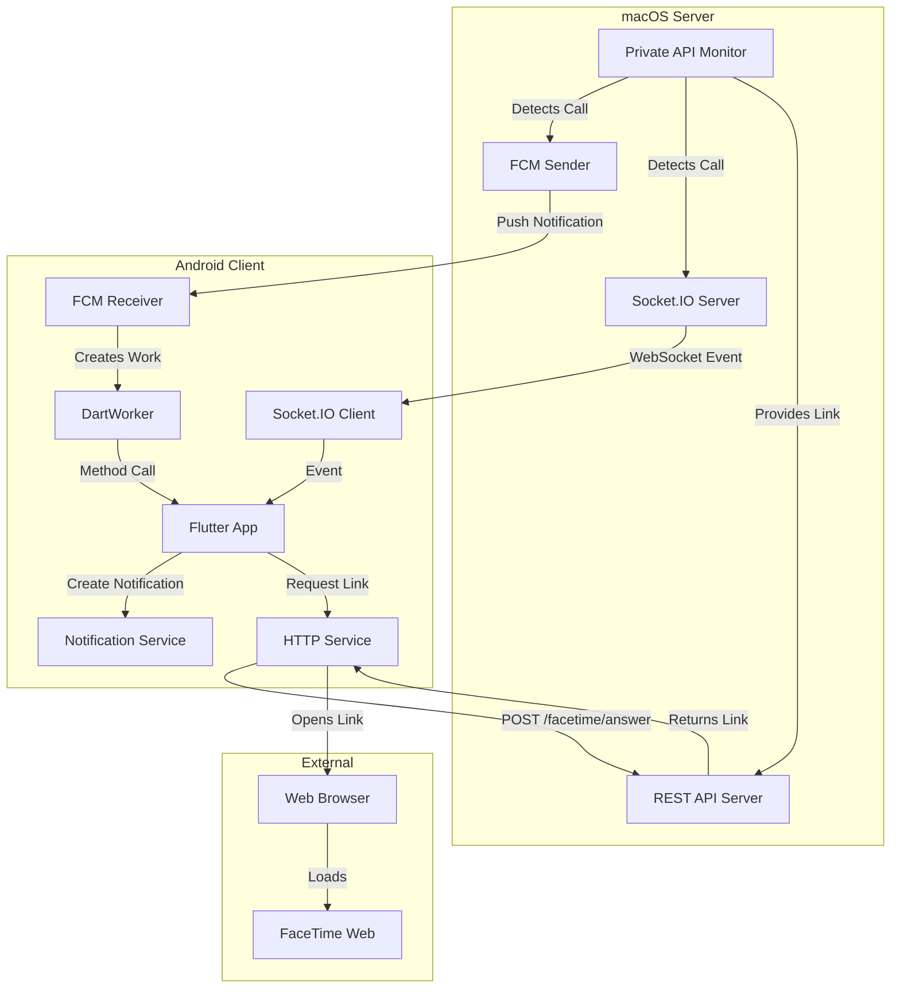
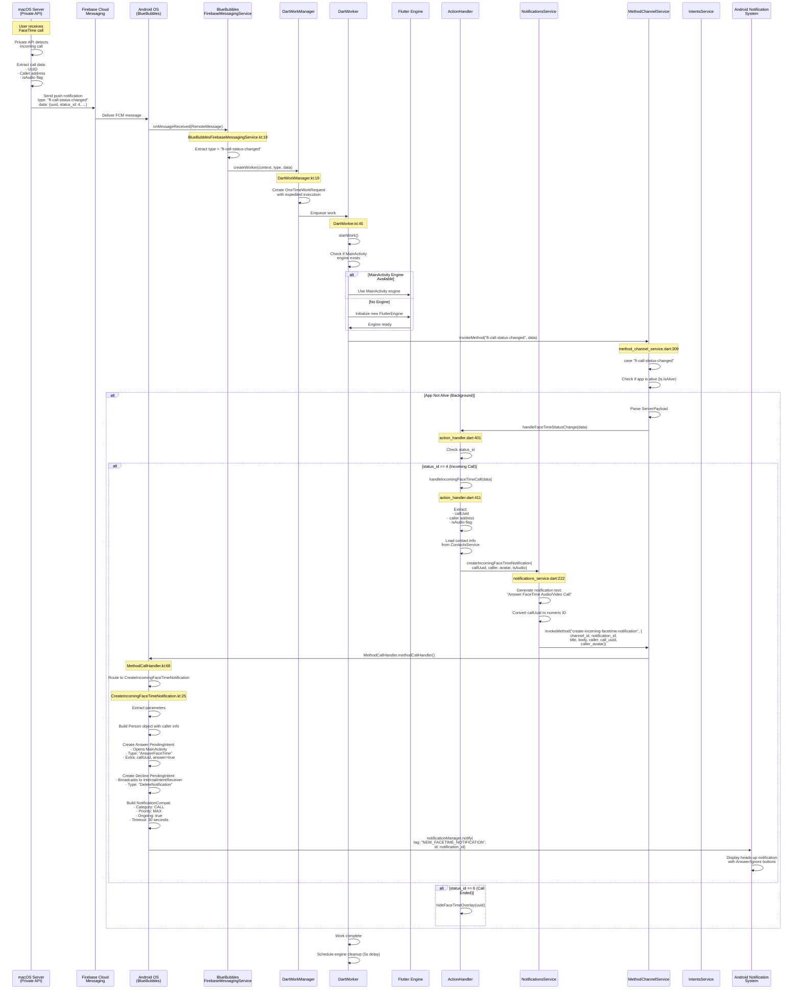
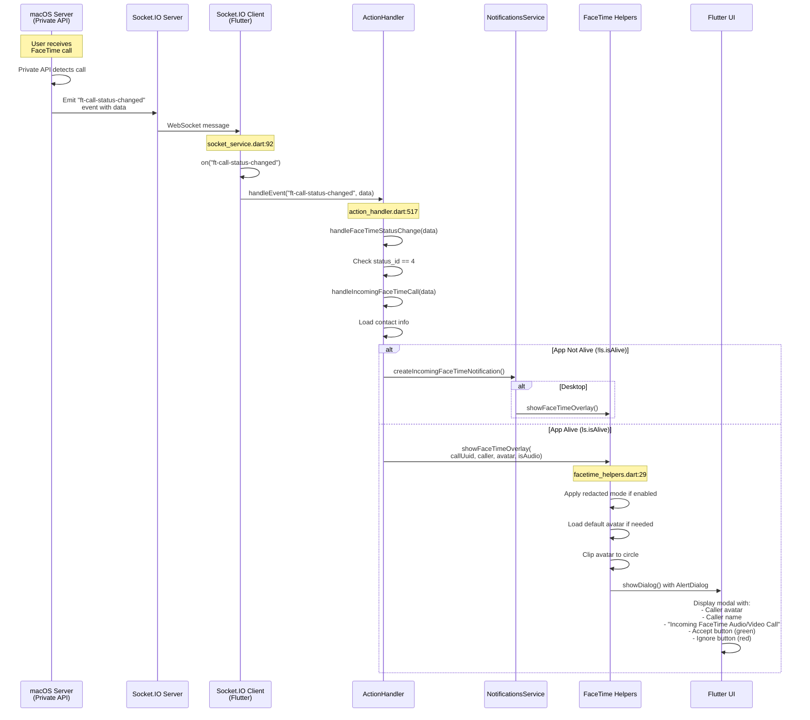
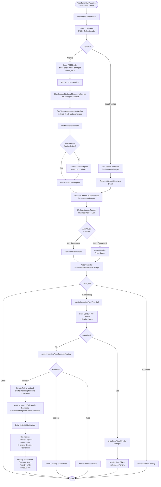
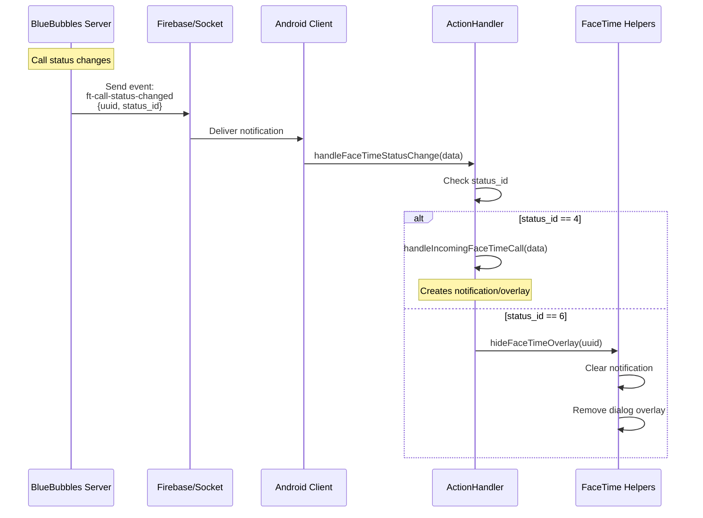
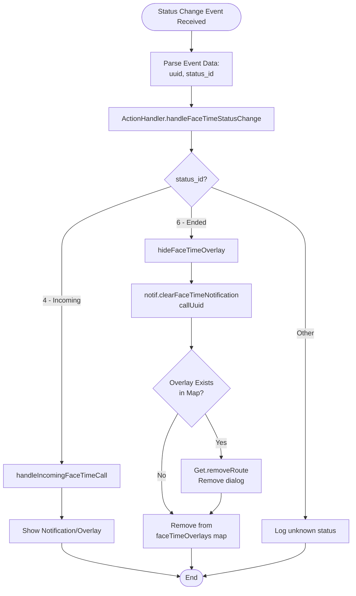
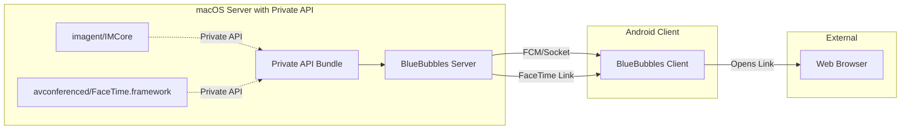

# BlueBubbles Android FaceTime Flow - Detailed Technical Documentation

## Table of Contents
1. [Architecture Overview](#architecture-overview)
2. [Incoming FaceTime Call Flow](#incoming-facetime-call-flow)
3. [Answering FaceTime Call Flow](#answering-facetime-call-flow)
4. [Call Status Change Flow](#call-status-change-flow)
5. [Component Details](#component-details)
6. [Private API Integration](#private-api-integration)

---

## Architecture Overview

### System Components

The BlueBubbles FaceTime system consists of three primary layers:

1. **BlueBubbles Server (macOS)**
   - Runs on macOS with access to FaceTime Private APIs
   - Detects incoming FaceTime calls
   - Generates FaceTime web links for answering calls
   - Sends notifications to clients via FCM/Socket.IO

2. **BlueBubbles Android Client**
   - Receives notifications via Firebase Cloud Messaging (FCM) or Socket.IO
   - Displays FaceTime call notifications
   - Requests FaceTime links from server
   - Launches external applications to handle calls

3. **External Application (Browser/FaceTime Handler)**
   - Handles actual audio/video streaming
   - Manages WebRTC connections
   - Displays call interface

### Critical Architectural Finding

**The BlueBubbles Android client does NOT handle FaceTime audio/video streaming directly.**

Instead, it:
- Acts as a notification relay
- Generates FaceTime web links via server API
- Opens links in external applications (browsers)
- The actual call happens OUTSIDE the BlueBubbles app

### Component Communication Diagram



---

## Incoming FaceTime Call Flow

### Overview
When someone initiates a FaceTime call to a BlueBubbles user, the server detects it via Private APIs and notifies the Android client.

### Sequence Diagram - FCM Path (Android Background)



### Sequence Diagram - Socket.IO Path (Web/Desktop)



### Flow Chart - Incoming Call Processing



### Key Data Structures

#### FCM Push Notification Payload
```json
{
  "type": "ft-call-status-changed",
  "status_id": 4,
  "uuid": "E621E1F8-C36C-495A-93FC-0C247A3E6E5F",
  "handle": {
    "address": "+1234567890"
  },
  "address": "+1234567890",
  "is_audio": false
}
```

#### Android Notification Parameters
```kotlin
Parameters (CreateIncomingFaceTimeNotification.kt:31-39):
- channel_id: String = "com.bluebubbles.incoming_facetimes"
- notification_id: Int = [derived from UUID]
- call_uuid: String = "E621E1F8-C36C-495A-93FC-0C247A3E6E5F"
- title: String = "John Doe"
- body: String = "Answer FaceTime Video Call"
- caller: String = "John Doe"
- caller_avatar: ByteArray? = [avatar image bytes]
```

#### PendingIntent IDs
```kotlin
Constants.kt:
- pendingIntentAnswerFaceTimeOffset = -100000
- pendingIntentDeclineFaceTimeOffset = -200000

Actual IDs:
- Answer Intent ID = notification_id + (-100000)
- Decline Intent ID = notification_id + (-200000)
```

---

## Answering FaceTime Call Flow

### Overview
When a user taps "Answer" on a FaceTime notification, the app requests a FaceTime web link from the server and opens it in an external application.

### Sequence Diagram - Answer Flow


### Flow Chart - Answer Process

```mermaid
flowchart TD
    START([User Taps Answer Button]) --> PENDING_INTENT[PendingIntent Triggered]
    PENDING_INTENT --> START_ACTIVITY[Start MainActivity with Intent:<br/>Type: AnswerFaceTime<br/>callUuid, answer=true]

    START_ACTIVITY --> MAIN_ACTIVITY_INIT[MainActivity Initializes]
    MAIN_ACTIVITY_INIT --> FLUTTER_ENGINE[Flutter Engine Starts]
    FLUTTER_ENGINE --> RECEIVE_INTENT[ReceiveIntent Plugin<br/>Delivers Intent]

    RECEIVE_INTENT --> INTENT_STREAM[receivedIntentStream]
    INTENT_STREAM --> HANDLE_INTENT[IntentsService.handleIntent]

    HANDLE_INTENT --> CHECK_UUID{Has callUuid<br/>Extra?}
    CHECK_UUID -->|No| END_FLOW([End])
    CHECK_UUID -->|Yes| CHECK_ANSWER{answer Extra<br/>== true?}

    CHECK_ANSWER -->|No| SHOW_OVERLAY[showFaceTimeOverlay<br/>Display Dialog]
    CHECK_ANSWER -->|Yes| ANSWER_FLOW[answerFaceTime Function]

    ANSWER_FLOW --> SHOW_LOADING[Show Loading Dialog:<br/>Generating link for call...]
    SHOW_LOADING --> HIDE_OVERLAY_CALL[hideFaceTimeOverlay<br/>Clear any existing overlay]

    HIDE_OVERLAY_CALL --> HTTP_CALL[HttpService.answerFaceTime<br/>POST /api/v1/facetime/answer/{callUuid}]
    HTTP_CALL --> ADD_AUTH[Add Query Param:<br/>guid = guidAuthKey]
    ADD_AUTH --> SEND_REQUEST[dio.post to server]

    SEND_REQUEST --> RESPONSE_CHECK{Response<br/>Success?}

    RESPONSE_CHECK -->|Error/Timeout| DISMISS_LOADING_ERR[Dismiss Loading Dialog]
    RESPONSE_CHECK -->|Success 200| PARSE_RESPONSE[Parse Response JSON]

    DISMISS_LOADING_ERR --> SHOW_ERROR[showSnackbar:<br/>Failed to answer FaceTime<br/>Unable to generate link]
    SHOW_ERROR --> END_FLOW

    PARSE_RESPONSE --> EXTRACT_LINK[Extract:<br/>link = response.data.data.link]
    EXTRACT_LINK --> LINK_CHECK{Link<br/>Present?}

    LINK_CHECK -->|No/Null| DISMISS_LOADING_ERR
    LINK_CHECK -->|Yes| DISMISS_LOADING_OK[Dismiss Loading Dialog]

    DISMISS_LOADING_OK --> PLATFORM_CHECK{Platform?}

    PLATFORM_CHECK -->|Mobile| LAUNCH_EXTERNAL[launchUrl(Uri.parse(link),<br/>mode: LaunchMode.externalApplication)]
    PLATFORM_CHECK -->|Web| WEB_TODO[TODO: Implement web FaceTime]

    LAUNCH_EXTERNAL --> OS_HANDLER[Android OS Handles URL]
    OS_HANDLER --> BROWSER_OPEN[Open Default Browser]
    BROWSER_OPEN --> LOAD_FACETIME[Load FaceTime Web URL]
    LOAD_FACETIME --> WEBRTC_INIT[Initialize WebRTC Connection]
    WEBRTC_INIT --> PERMISSIONS[Request Camera/Mic Permissions]
    PERMISSIONS --> CALL_UI[Display FaceTime Call UI]
    CALL_UI --> USER_IN_CALL([User in FaceTime Call<br/>via Browser])

    SHOW_OVERLAY --> USER_CHOICE{User Action?}
    USER_CHOICE -->|Accept| ANSWER_FLOW
    USER_CHOICE -->|Ignore| HIDE_OVERLAY_IGNORE[hideFaceTimeOverlay]
    HIDE_OVERLAY_IGNORE --> END_FLOW

    WEB_TODO --> END_FLOW
```

### API Request Details

#### HTTP Request
```
Method: POST
URL: https://[server-address]/api/v1/facetime/answer/E621E1F8-C36C-495A-93FC-0C247A3E6E5F
Query Parameters:
  - guid: [guidAuthKey from settings]
Headers:
  - [Custom headers from settings]
  - Content-Type: application/json
Body: {}
```

#### HTTP Response (Success)
```json
{
  "status": 200,
  "message": "Success",
  "data": {
    "link": "https://facetime.apple.com/join#v=1&p=ABC123XYZ&k=DEF456UVW"
  }
}
```

#### HTTP Response (Error)
```json
{
  "status": 500,
  "message": "Failed to generate FaceTime link",
  "error": "Call not found or expired"
}
```

### Key Code References

#### IntentsService.answerFaceTime
**File**: `lib/services/backend/java_dart_interop/intents_service.dart:115-158`

```dart
Future<void> answerFaceTime(String callUuid) async {
  // Show loading dialog
  showDialog(
    context: Get.context!,
    builder: (BuildContext context) {
      return AlertDialog(
        title: Text("Generating link for call..."),
        content: CircularProgressIndicator(),
      );
    }
  );

  // Clear any existing overlay
  hideFaceTimeOverlay(callUuid);

  // Request link from server
  String? link;
  try {
    final call = await http.answerFaceTime(callUuid);
    link = call.data?["data"]?["link"];
  } catch (_) {}

  // Dismiss loading dialog
  if (Get.context != null) {
    Navigator.of(Get.context!).pop();
  }

  // Handle response
  if (link == null) {
    return showSnackbar("Failed to answer FaceTime", "Unable to generate FaceTime link!");
  }

  // Launch external browser
  if (!kIsWeb) {
    await launchUrl(Uri.parse(link), mode: LaunchMode.externalApplication);
  }
}
```

#### HttpService.answerFaceTime
**File**: `lib/services/network/http_service.dart:981-991`

```dart
Future<Response> answerFaceTime(String callUuid, {CancelToken? cancelToken}) async {
  return runApiGuarded(() async {
    final response = await dio.post(
      "$apiRoot/facetime/answer/$callUuid",
      queryParameters: buildQueryParams(),
      data: {},
      cancelToken: cancelToken
    );
    return returnSuccessOrError(response);
  });
}
```

---

## Call Status Change Flow

### Overview
The server sends status updates for FaceTime calls. Status ID 4 indicates an incoming call, while status ID 6 indicates the call has ended.

### Status ID Codes

```
Status IDs (observed):
- 4: Incoming call (ringing)
- 6: Call ended/terminated
```

### Sequence Diagram - Status Change



### Flow Chart - Status Change Handling



### Code Reference - Status Change Handler

**File**: `lib/services/backend/action_handler.dart:401-409`

```dart
Future<void> handleFaceTimeStatusChange(Map<String, dynamic> data) async {
  if (data["status_id"] == null) return;
  final int statusId = data["status_id"] as int;

  if (statusId == 4) {
    // Incoming call
    await ActionHandler().handleIncomingFaceTimeCall(data);
  } else if (statusId == 6 && data["uuid"] != null) {
    // Call ended
    hideFaceTimeOverlay(data["uuid"]!);
  }
}
```

**File**: `lib/helpers/ui/facetime_helpers.dart:19-25`

```dart
void hideFaceTimeOverlay(String callUuid) {
  // Clear the notification
  notif.clearFaceTimeNotification(callUuid);

  // Remove the dialog overlay if it exists
  if (faceTimeOverlays.containsKey(callUuid)) {
    Get.removeRoute(faceTimeOverlays[callUuid]!);
    faceTimeOverlays.remove(callUuid);
  }
}
```

---

## Component Details

### Android Native Components

#### 1. BlueBubblesFirebaseMessagingService

**File**: `android/app/src/main/kotlin/com/bluebubbles/messaging/services/firebase/BlueBubblesFirebaseMessagingService.kt`

**Purpose**: Receives FCM push notifications from server

**Key Methods**:
- `onMessageReceived(message: RemoteMessage)` - Line 19
  - Extracts message type from `message.data["type"]`
  - Creates DartWorker to process the event
  - Optionally sends event to Tasker if configured

**FCM Message Structure**:
```kotlin
message.data = HashMap<String, String> {
  "type": "ft-call-status-changed",
  "status_id": "4",
  "uuid": "E621E1F8-...",
  "handle": "{\"address\":\"+1234567890\"}",
  "address": "+1234567890",
  "is_audio": "false"
}
```

#### 2. DartWorkManager

**File**: `android/app/src/main/kotlin/com/bluebubbles/messaging/services/backend_ui_interop/DartWorkManager.kt`

**Purpose**: Creates background workers to process FCM events

**Key Methods**:
- `createWorker(context, method, arguments, callback)` - Line 19
  - Serializes arguments to JSON using Gson
  - Creates OneTimeWorkRequest with expedited execution policy
  - Enqueues work with WorkManager
  - Observes completion and runs callback

**Work Configuration**:
```kotlin
OneTimeWorkRequest.Builder(DartWorker::class.java)
  .setExpedited(OutOfQuotaPolicy.RUN_AS_NON_EXPEDITED_WORK_REQUEST)
  .setInputData(Data.Builder()
    .putString("method", method)
    .putString("data", gson.toJson(arguments))
    .build())
  .addTag(Constants.dartWorkerTag)
  .build()
```

#### 3. DartWorker

**File**: `android/app/src/main/kotlin/com/bluebubbles/messaging/services/backend_ui_interop/DartWorker.kt`

**Purpose**: Executes Dart code in background to process FCM events

**Key Methods**:
- `startWork()` - Line 45
  - Checks if MainActivity engine is available
  - Initializes new FlutterEngine if needed
  - Invokes method on Flutter side via MethodChannel
  - Schedules engine cleanup after 5 seconds

**Engine Initialization** (Line 118-145):
```kotlin
private suspend fun initNewEngine() {
  // Ensure Flutter is initialized
  FlutterMain.startInitialization(applicationContext)
  FlutterMain.ensureInitializationComplete(applicationContext, null)

  // Create new Flutter engine
  workerEngine = FlutterEngine(applicationContext)

  // Set up MethodChannel
  MethodChannel(workerEngine!!.dartExecutor.binaryMessenger, Constants.methodChannel)
    .setMethodCallHandler { call, result ->
      if (call.method == "ready") {
        // Engine ready
      } else {
        MethodCallHandler().methodCallHandler(call, result, applicationContext)
      }
    }

  // Execute Dart callback
  val callbackInfo = FlutterCallbackInformation.lookupCallbackInformation(
    applicationContext.getSharedPreferences("FlutterSharedPreferences", 0)
      .getLong("flutter.backgroundCallbackHandle", -1)
  )
  val callback = DartExecutor.DartCallback(applicationContext.assets, info.flutterAssetsDir, callbackInfo)
  workerEngine!!.dartExecutor.executeDartCallback(callback)
}
```

#### 4. CreateIncomingFaceTimeNotification

**File**: `android/app/src/main/kotlin/com/bluebubbles/messaging/services/notifications/CreateIncomingFaceTimeNotification.kt`

**Purpose**: Creates and displays Android notification for incoming FaceTime calls

**Key Methods**:
- `handleMethodCall(call, result, context)` - Line 25

**Parameters Received** (Lines 31-41):
```kotlin
val channelId: String = call.argument("channel_id")!!
val notificationId: Int = call.argument("notification_id")!!
val callUuid: String? = call.argument("call_uuid")
val title: String = call.argument("title")!!
val body: String = call.argument("body")!!
val callerName: String = call.argument("caller")!!
val callerIcon: ByteArray? = call.argument("caller_avatar")
```

**Notification Actions**:

1. **Answer Action** (Lines 67-79):
```kotlin
val answerIntent = PendingIntent.getActivity(
  context,
  notificationId + Constants.pendingIntentAnswerFaceTimeOffset, // -100000
  Intent(context, MainActivity::class.java)
    .putExtras(extras)
    .putExtra("answer", true)
    .putExtra("caller", callerName)
    .setType("AnswerFaceTime"),
  PendingIntent.FLAG_IMMUTABLE
)
```

2. **Decline Action** (Lines 82-92):
```kotlin
val declineIntent = PendingIntent.getBroadcast(
  context,
  notificationId + Constants.pendingIntentDeclineFaceTimeOffset, // -200000
  Intent(context, InternalIntentReceiver::class.java)
    .putExtra("notificationId", notificationId)
    .setType("DeleteNotification"),
  PendingIntent.FLAG_IMMUTABLE
)
```

**Notification Properties** (Lines 94-115):
```kotlin
val notificationBuilder = NotificationCompat.Builder(context, channelId)
  .setSmallIcon(R.mipmap.ic_stat_icon)
  .setAutoCancel(true)
  .setOngoing(true)  // Cannot be dismissed
  .setCategory(NotificationCompat.CATEGORY_CALL)
  .setPriority(NotificationCompat.PRIORITY_MAX)
  .setContentTitle(title)
  .setContentText(body)
  .addPerson(caller)
  .setColor(4888294)  // Blue color
  .addAction(answerAction)
  .addAction(declineAction)
  .setTimeoutAfter(30000)  // Clear after 30 seconds
```

#### 5. MainActivity

**File**: `android/app/src/main/kotlin/com/bluebubbles/messaging/MainActivity.kt`

**Purpose**: Main Flutter activity, receives intents from notifications

**Key Points**:
- Extends FlutterFragmentActivity
- Configures Flutter engine and MethodChannel
- Does NOT explicitly handle FaceTime intents
- Intent extras are read by Flutter's ReceiveIntent plugin

**MethodChannel Setup** (Lines 22-24):
```kotlin
MethodChannel(flutterEngine.dartExecutor.binaryMessenger, Constants.methodChannel)
  .setMethodCallHandler { call, result ->
    MethodCallHandler().methodCallHandler(call, result, this)
  }
```

### Flutter/Dart Components

#### 1. IntentsService

**File**: `lib/services/backend/java_dart_interop/intents_service.dart`

**Purpose**: Handles Android intents, including FaceTime answer intents

**Key Methods**:

**init()** - Line 29:
- Sets up intent stream listener
- Uses ReceiveIntent plugin
- Handles initial intent and stream

**handleIntent(Intent?)** - Line 48:
```dart
void handleIntent(Intent? intent) async {
  if (intent == null) return;

  switch (intent.action) {
    // Handle various action types
    default:
      if (intent.extra?["callUuid"] != null) {
        await StartupTasks.waitForUI();
        if (intent.extra?["answer"] == true) {
          // User tapped Answer button
          await answerFaceTime(intent.extra?["callUuid"]!);
        } else {
          // User tapped notification body
          await showFaceTimeOverlay(
            intent.extra?["callUuid"],
            intent.extra?["caller"],
            null,
            false
          );
        }
      }
  }
}
```

**answerFaceTime(String)** - Line 115:
```dart
Future<void> answerFaceTime(String callUuid) async {
  if (Get.context != null) {
    showDialog(
      context: Get.context!,
      builder: (BuildContext context) {
        return AlertDialog(
          backgroundColor: context.theme.colorScheme.properSurface,
          title: Text("Generating link for call..."),
          content: Container(
            height: 70,
            child: Center(
              child: CircularProgressIndicator(),
            ),
          ),
        );
      }
    );
    hideFaceTimeOverlay(callUuid);
  }

  String? link;
  try {
    final call = await http.answerFaceTime(callUuid);
    link = call.data?["data"]?["link"];
  } catch (_) {}

  if (Get.context != null) {
    Navigator.of(Get.context!).pop();
  }

  if (link == null) {
    return showSnackbar("Failed to answer FaceTime", "Unable to generate FaceTime link!");
  }

  if (!kIsWeb) {
    await launchUrl(Uri.parse(link), mode: LaunchMode.externalApplication);
  } else if (kIsWeb) {
    // TODO: Implement web FaceTime
  }
}
```

#### 2. ActionHandler

**File**: `lib/services/backend/action_handler.dart`

**Purpose**: Central event handler for server events

**Key Methods**:

**handleEvent(String, Map, String)** - Line 455:
- Main event router
- Handles "ft-call-status-changed" and "incoming-facetime" events

**handleFaceTimeStatusChange(Map)** - Line 401:
```dart
Future<void> handleFaceTimeStatusChange(Map<String, dynamic> data) async {
  if (data["status_id"] == null) return;
  final int statusId = data["status_id"] as int;

  if (statusId == 4) {
    // Incoming call
    await ActionHandler().handleIncomingFaceTimeCall(data);
  } else if (statusId == 6 && data["uuid"] != null) {
    // Call ended
    hideFaceTimeOverlay(data["uuid"]!);
  }
}
```

**handleIncomingFaceTimeCall(Map)** - Line 411:
```dart
Future<void> handleIncomingFaceTimeCall(Map<String, dynamic> data) async {
  Logger.info("Handling incoming FaceTime call");
  await cs.init();  // Initialize contacts service

  final callUuid = data["uuid"];
  String? address = data["handle"]?["address"];
  String caller = data["address"] ?? "Unknown Number";
  bool isAudio = data["is_audio"];
  Uint8List? chatIcon;

  // Find the contact info for the caller
  if (address != null) {
    Contact? contact = cs.getContact(address);
    chatIcon = contact?.avatar;
    caller = contact?.displayName ?? caller;
  }

  if (!ls.isAlive) {
    // App not alive, create notification
    if (kIsDesktop) {
      await showFaceTimeOverlay(callUuid, caller, chatIcon, isAudio);
    }
    await notif.createIncomingFaceTimeNotification(callUuid, caller, chatIcon, isAudio);
  } else {
    // App alive, show overlay
    await showFaceTimeOverlay(callUuid, caller, chatIcon, isAudio);
  }
}
```

**handleIncomingFaceTimeCallLegacy(Map)** - Line 438:
```dart
Future<void> handleIncomingFaceTimeCallLegacy(Map<String, dynamic> data) async {
  Logger.info("Handling incoming FaceTime call (legacy)");
  await cs.init();
  String? address = data["caller"];
  String? caller = address;
  Uint8List? chatIcon;

  // Find contact info
  if (address != null) {
    Contact? contact = cs.getContact(address);
    chatIcon = contact?.avatar;
    caller = contact?.displayName ?? caller;
    await notif.createIncomingFaceTimeNotification(null, caller!, chatIcon, false);
  }
}
```

#### 3. NotificationsService

**File**: `lib/services/backend/notifications/notifications_service.dart`

**Purpose**: Manages all notifications including FaceTime

**Constants** (Lines 34-38):
```dart
static const String FACETIME_CHANNEL = "com.bluebubbles.incoming_facetimes";
static const String NEW_FACETIME_TAG = "com.bluebubbles.messaging.NEW_FACETIME_NOTIFICATION";
```

**Key Methods**:

**createIncomingFaceTimeNotification()** - Line 222:
```dart
Future<void> createIncomingFaceTimeNotification(
  String? callUuid,
  String caller,
  Uint8List? chatIcon,
  bool isAudio
) async {
  // Set notification defaults
  String title = caller;
  String text = "${callUuid == null ? "Incoming" : "Answer"} FaceTime ${isAudio ? 'Audio' : 'Video'} Call";
  chatIcon ??= (await rootBundle.load("assets/images/person64.png")).buffer.asUint8List();

  if (kIsWeb && Notification.permission == "granted") {
    // Web notification
    final notif = Notification(title, body: text, icon: "data:image/png;base64,${base64Encode(chatIcon)}", tag: callUuid);
    if (callUuid != null) {
      notif.onClick.listen((event) async {
        await intents.answerFaceTime(callUuid);
      });
    }
  } else if (kIsDesktop) {
    // Desktop notification
    _lock.synchronized(() async => await showPersistentDesktopFaceTimeNotif(callUuid, caller, chatIcon, isAudio));
  } else {
    // Android notification
    final numeric = callUuid?.numericOnly();
    await mcs.invokeMethod("create-incoming-facetime-notification", {
      "channel_id": FACETIME_CHANNEL,
      "notification_id": numeric != null ? int.parse(numeric.substring(0, min(8, numeric.length))) : Random().nextInt(9998) + 1,
      "title": title,
      "body": text,
      "caller_avatar": chatIcon,
      "caller": caller,
      "call_uuid": callUuid
    });
  }
}
```

**clearFaceTimeNotification()** - Line 251:
```dart
Future<void> clearFaceTimeNotification(String callUuid) async {
  if (kIsDesktop) {
    await clearDesktopFaceTimeNotif(callUuid);
  } else if (!kIsWeb) {
    final numeric = callUuid.numericOnly();
    mcs.invokeMethod(
      "delete-notification",
      {
        "notification_id": int.parse(numeric.substring(0, min(8, numeric.length))),
        "notification_tag": NEW_FACETIME_TAG
      }
    );
  }
}
```

#### 4. FaceTime Helpers

**File**: `lib/helpers/ui/facetime_helpers.dart`

**Purpose**: UI helpers for FaceTime overlays

**Global State**:
```dart
Map<String, Route> faceTimeOverlays = {};  // Map from call uuid to overlay route
```

**Key Functions**:

**hideFaceTimeOverlay()** - Line 19:
```dart
void hideFaceTimeOverlay(String callUuid) {
  notif.clearFaceTimeNotification(callUuid);
  if (faceTimeOverlays.containsKey(callUuid)) {
    Get.removeRoute(faceTimeOverlays[callUuid]!);
    faceTimeOverlays.remove(callUuid);
  }
}
```

**showFaceTimeOverlay()** - Line 29:
```dart
Future<void> showFaceTimeOverlay(
  String callUuid,
  String caller,
  Uint8List? chatIcon,
  bool isAudio
) async {
  // Apply redacted mode if enabled
  if (ss.settings.redactedMode.value && ss.settings.hideContactInfo.value) {
    if (chatIcon != null) chatIcon = null;
    caller = faker.person.name();
  }

  // Load default avatar if needed
  chatIcon ??= (await rootBundle.load("assets/images/person64.png")).buffer.asUint8List();
  chatIcon = await clip(chatIcon, size: 256, circle: true);

  // Close existing overlay
  hideFaceTimeOverlay(callUuid);

  // Show dialog
  showDialog(
    context: Get.context!,
    barrierDismissible: false,
    builder: (_) {
      return BackdropFilter(
        filter: ImageFilter.blur(sigmaX: 2, sigmaY: 2),
        child: AlertDialog(
          icon: Image.memory(chatIcon!, width: 48, height: 48),
          title: Text(caller),
          content: Text(
            "Incoming FaceTime ${isAudio ? "Audio" : "Video"} Call",
            textAlign: TextAlign.center,
          ),
          actionsAlignment: MainAxisAlignment.center,
          actions: [
            // Accept button
            MaterialButton(
              color: Colors.green.withOpacity(0.2),
              child: Column(
                children: [
                  Icon(Icons.call_outlined, color: Colors.green),
                  const Text("Accept"),
                ],
              ),
              onPressed: () async {
                await intents.answerFaceTime(callUuid);
              },
            ),
            const SizedBox(width: 16.0),
            // Ignore button
            MaterialButton(
              color: Colors.red.withOpacity(0.2),
              child: Column(
                children: [
                  Icon(Icons.call_end_outlined, color: Colors.red),
                  const Text("Ignore"),
                ],
              ),
              onPressed: () {
                hideFaceTimeOverlay(callUuid);
              },
            ),
          ],
        ),
      );
    }
  ).then((_) => faceTimeOverlays.remove(callUuid));

  // Save dialog as overlay route
  faceTimeOverlays[callUuid] = Get.rawRoute!;
}
```

#### 5. HttpService

**File**: `lib/services/network/http_service.dart`

**Purpose**: HTTP client for server API calls

**API Configuration** (Lines 19-30):
```dart
String get origin => originOverride ?? (Uri.parse(ss.settings.serverAddress.value).hasScheme ? Uri.parse(ss.settings.serverAddress.value).origin : '');
String get apiRoot => "$origin/api/v1";

Map<String, dynamic> buildQueryParams([Map<String, dynamic> params = const {}]) {
  if (params.isEmpty) {
    params = {};
  }
  params['guid'] = ss.settings.guidAuthKey.value;
  return params;
}
```

**answerFaceTime()** - Line 981:
```dart
/// Answers a facetime call with the given [callUuid].
/// The response is a data object with a `link` key that contains the link to the call.
Future<Response> answerFaceTime(String callUuid, {CancelToken? cancelToken}) async {
  return runApiGuarded(() async {
    final response = await dio.post(
      "$apiRoot/facetime/answer/$callUuid",
      queryParameters: buildQueryParams(),
      data: {},
      cancelToken: cancelToken
    );
    return returnSuccessOrError(response);
  });
}
```

#### 6. SocketService

**File**: `lib/services/network/socket_service.dart`

**Purpose**: Socket.IO client for real-time server communication

**Key Methods**:

**startSocket()** - Line 57:
```dart
void startSocket() {
  OptionBuilder options = OptionBuilder()
    .setQuery({"guid": password})
    .setTransports(['websocket', 'polling'])
    .setExtraHeaders(http.headers)
    .disableAutoConnect()
    .enableReconnection();
  socket = io(serverAddress, options.build());

  // Connection handlers
  socket.onConnect((data) => handleStatusUpdate(SocketState.connected, data));
  socket.onDisconnect((data) => handleStatusUpdate(SocketState.disconnected, data));
  socket.onError((data) => handleStatusUpdate(SocketState.error, data));

  // Custom events - only for web/desktop (Android uses FCM)
  if (kIsWeb || kIsDesktop) {
    socket.on("incoming-facetime", (data) => ah.handleEvent("incoming-facetime", jsonDecode(data), 'DartSocket'));
  }

  // Events for all platforms
  socket.on("ft-call-status-changed", (data) => ah.handleEvent("ft-call-status-changed", data, 'DartSocket'));

  socket.connect();
}
```

**Event Listeners** (Lines 84-92):
```dart
// Only listen to these events from socket on web/desktop (FCM handles on Android)
if (kIsWeb || kIsDesktop) {
  socket.on("group-name-change", (data) => ah.handleEvent("group-name-change", data, 'DartSocket'));
  socket.on("participant-removed", (data) => ah.handleEvent("participant-removed", data, 'DartSocket'));
  socket.on("participant-added", (data) => ah.handleEvent("participant-added", data, 'DartSocket'));
  socket.on("participant-left", (data) => ah.handleEvent("participant-left", data, 'DartSocket'));
  socket.on("incoming-facetime", (data) => ah.handleEvent("incoming-facetime", jsonDecode(data), 'DartSocket'));
}

socket.on("ft-call-status-changed", (data) => ah.handleEvent("ft-call-status-changed", data, 'DartSocket'));
```

#### 7. MethodChannelService

**File**: `lib/services/backend/java_dart_interop/method_channel_service.dart`

**Purpose**: Handles method calls from Android native code (via DartWorker)

**Event Handlers**:

**"incoming-facetime"** - Line 295:
```dart
case "incoming-facetime":
  await Database.waitForInit();
  Logger.info("Received legacy incoming facetime from FCM");
  try {
    Map<String, dynamic>? data = arguments;
    if (!isNullOrEmpty(data)) {
      final payload = ServerPayload.fromJson(data!);
      await ActionHandler().handleIncomingFaceTimeCallLegacy(payload.data);
    }
  } catch (e, s) {
    return Future.error(e, s);
  }
  return Future.value(true);
```

**"ft-call-status-changed"** - Line 309:
```dart
case "ft-call-status-changed":
  if (ls.isAlive) return Future.value(true);  // Skip if app is alive
  await Database.waitForInit();
  Logger.info("Received facetime call status change from FCM");

  try {
    Map<String, dynamic>? data = arguments;
    if (!isNullOrEmpty(data)) {
      final payload = ServerPayload.fromJson(data!);
      await ActionHandler().handleFaceTimeStatusChange(payload.data);
    }
  } catch (e, s) {
    return Future.error(e, s);
  }

  return Future.value(true);
```

---

## Private API Integration

### Server-Side Private API

The BlueBubbles server (running on macOS) uses Apple's private APIs to:

1. **Detect Incoming FaceTime Calls**
   - Monitors system for FaceTime call events
   - Extracts call metadata (UUID, caller, audio/video type)

2. **Generate FaceTime Web Links**
   - Creates shareable FaceTime links
   - Links can be opened in web browsers
   - Uses Apple's FaceTime web infrastructure

3. **Send Notifications**
   - Pushes call data to clients via FCM or Socket.IO
   - Includes call UUID, caller information, and call type

### Client-Side Private API Usage

**Important**: The Android client does NOT directly use any Private APIs.

All Private API functionality is handled server-side:
- Call detection: Server
- Link generation: Server
- Media streaming: External browser (via FaceTime web)

### Private API Requirements

From the settings panel (`lib/app/layouts/settings/pages/advanced/private_api_panel.dart`):

**Server Requirements**:
- Private API bundle must be installed on macOS server
- Server setting `ss.settings.serverPrivateAPI.value` must be `true`

**Client Settings**:
- `ss.settings.enablePrivateAPI.value` - Enables Private API features in client
- `ss.settings.privateAPISend.value` - Use Private API for sending messages
- `ss.settings.privateAPIAttachmentSend.value` - Use Private API for attachments

**FaceTime-Specific**:
- No specific FaceTime settings in client
- FaceTime availability depends solely on server having Private API enabled

### Data Flow - Private API Context



### Server API Endpoint

**Endpoint**: `/api/v1/facetime/answer/:callUuid`

**Method**: POST

**Authentication**: Query parameter `guid` (GUID auth key)

**Request**:
```
POST /api/v1/facetime/answer/E621E1F8-C36C-495A-93FC-0C247A3E6E5F?guid=<auth-key>
Body: {}
```

**Response (Success)**:
```json
{
  "status": 200,
  "message": "Success",
  "data": {
    "link": "https://facetime.apple.com/join#v=1&p=<token>&k=<key>"
  }
}
```

**Response (Error)**:
```json
{
  "status": 500,
  "message": "Failed to generate FaceTime link",
  "error": "Call not found or expired"
}
```

### FaceTime Web Link Format

The server generates links in Apple's FaceTime web format:

```
https://facetime.apple.com/join#v=1&p=<participant-token>&k=<key>
```

**Components**:
- `v=1`: Version
- `p=<token>`: Participant token (encrypted/encoded)
- `k=<key>`: Key for call authentication

These links can be opened in:
- Safari (iOS/macOS)
- Chrome (Android/Desktop)
- Edge (Desktop)
- Other modern browsers with WebRTC support

---

## Summary

### Key Architectural Points

1. **No Direct Media Handling**
   - Android client does NOT handle audio/video streaming
   - Media is handled by external browsers via FaceTime web

2. **Notification Relay Pattern**
   - Client receives notifications via FCM/Socket.IO
   - Displays Android notifications with Answer/Ignore actions
   - Requests FaceTime links from server
   - Opens links externally

3. **Server-Centric Architecture**
   - All Private API usage is server-side
   - Server detects calls and generates links
   - Server sends notifications to clients

4. **External Application Dependency**
   - Actual FaceTime call happens in web browser
   - Browser handles WebRTC connections
   - Browser manages audio/video streaming

### Communication Paths

**Android Background (FCM)**:
```
Server → FCM → FirebaseMessagingService → DartWorker → Flutter → Notification
```

**Web/Desktop (Socket.IO)**:
```
Server → Socket.IO → SocketService → ActionHandler → Notification/Overlay
```

**Answer Flow**:
```
User → Notification → MainActivity → IntentsService → HttpService → Server → Link → Browser
```

### File Location Summary

**Android Native**:
- `android/app/src/main/kotlin/com/bluebubbles/messaging/services/firebase/BlueBubblesFirebaseMessagingService.kt`
- `android/app/src/main/kotlin/com/bluebubbles/messaging/services/backend_ui_interop/DartWorkManager.kt`
- `android/app/src/main/kotlin/com/bluebubbles/messaging/services/backend_ui_interop/DartWorker.kt`
- `android/app/src/main/kotlin/com/bluebubbles/messaging/services/notifications/CreateIncomingFaceTimeNotification.kt`
- `android/app/src/main/kotlin/com/bluebubbles/messaging/MainActivity.kt`
- `android/app/src/main/kotlin/com/bluebubbles/messaging/Constants.kt`

**Flutter/Dart**:
- `lib/services/backend/java_dart_interop/intents_service.dart`
- `lib/services/backend/action_handler.dart`
- `lib/services/backend/notifications/notifications_service.dart`
- `lib/helpers/ui/facetime_helpers.dart`
- `lib/services/network/http_service.dart`
- `lib/services/network/socket_service.dart`
- `lib/services/backend/java_dart_interop/method_channel_service.dart`

---

## Conclusion

The BlueBubbles Android FaceTime implementation is a **notification relay system** rather than a full WebRTC implementation. It cleverly leverages:

1. Apple's Private APIs (server-side only)
2. Firebase Cloud Messaging for push notifications
3. FaceTime web links for actual call handling
4. External browsers for media streaming

This architecture allows Android users to participate in FaceTime calls without requiring complex WebRTC implementation in the client app, while maintaining a seamless user experience.
